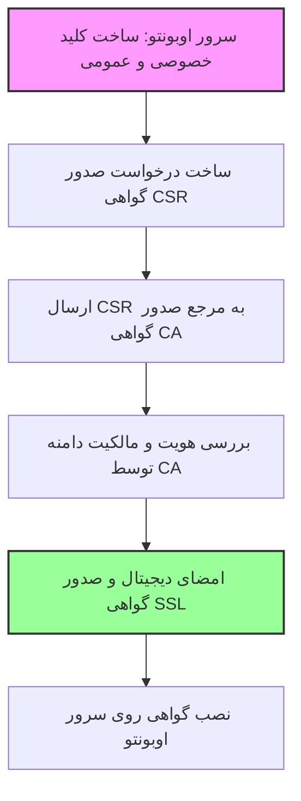
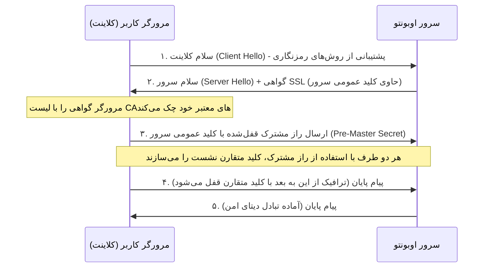

# راهنمای جامع و به زبان ساده: گواهی SSL، نحوه کارکرد و معماری امنیت در وب

هدف این سند، کالبدشکافی مفهوم گواهی **SSL/TLS**، نحوه صدور، فرآیند دست‌دهی (Handshake)، لایه‌های رمزنگاری و پاسخ به این سوال حیاتی است که **«چه کسانی می‌توانند اطلاعات ما را در بستر اینترنت ببینند؟»**

---

## ۱. گواهی SSL چیست و چه فرقی با رمزنگاری کلیدها دارد؟

شما با مفاهیم **کلید متقارن (Symmetric)** و **کلید نامتقارن (Asymmetric)** آشنا هستید:
*   **کلید متقارن:** یک کلید واحد برای قفل کردن و باز کردن داده‌ها (مانند یک کلید فیزیکی در خانه). سریع است اما انتقال ایمن کلید بین دو نفر سخت است.
*   **کلید نامتقارن:** دو کلید متفاوت (کلید عمومی برای قفل کردن و کلید خصوصی برای باز کردن). بسیار امن است اما از نظر پردازشی کند است.

### ❓ پس گواهی SSL این وسط چه کاره است؟
اگر کلیدهای نامتقارن را داشته باشیم، چرا به **گواهی SSL (Secure Sockets Layer)** نیاز داریم؟
پاسخ در یک کلمه است: **اعتماد (Trust)**.

فرض کنید می‌خواهید به سایت بانک ملی متصل شوید. بانک ملی کلید عمومی خود را برای شما می‌فرستد تا اطلاعات را با آن قفل کنید. اما از کجا مطمئن هستید کسی که خود را بانک ملی معرفی کرده، واقعاً بانک ملی است و یک هکر (نفر وسط) کلید خودش را به شما قالب نکرده است؟
**گواهی SSL مانند شناسنامه یا کارت ملی دیجیتال سرور است** که توسط یک سازمان معتبر و سوم‌شخص صادر شده و هویت سرور را برای شما تضمین می‌کند.

---

## ۲. گواهی SSL چگونه تولید و صادر می‌شود؟ (از صفر تا صد)

فرآیند صدور یک گواهی SSL معتبر برای یک دامنه (مثلاً `my-project-share.xyz`) طی مراحل زیر انجام می‌شود:

1. **گام اول: ساخت جفت‌کلید روی سرور خودتان 🔑**
   ابتدا روی سرور اوبونتو یک **کلید خصوصی (Private Key)** و یک **کلید عمومی (Public Key)** ساخته می‌شود. کلید خصوصی مثل ناموس سرور است و هرگز نباید از سرور خارج شود.
2. **گام دوم: ساخت درخواست گواهی (CSR - Certificate Signing Request) 📝**
   سرور شما یک فایل متنی به نام CSR می‌سازد. این فایل حاوی کلید عمومی شما به همراه اطلاعاتی مانند نام دامنه، نام شرکت و کشور است.
3. **گام سوم: ارسال به مرجع صدور گواهی (CA - Certificate Authority) 🏛️**
   شما فایل CSR را برای یک سازمان معتبر صادرکننده گواهی در دنیا (مانند **Let's Encrypt** یا **Sectigo**) می‌فرستید.
4. **گام چهارم: اعتبارسنجی مالکیت دامنه (Validation) 🔍**
   سازمان CA بررسی می‌کند که آیا شما واقعاً صاحب دامنه `my-project-share.xyz` هستید یا خیر. این کار معمولاً با فرستادن یک فایل موقت روی هاست شما یا ساخت یک رکورد DNS انجام می‌شود.
5. **گام پنجم: امضا و صدور گواهی (Signing) ✍️**
   پس از تایید، سازمان CA اطلاعات شما را برمی‌دارد و با استفاده از **کلید خصوصی خودش** آن را مهر و امضا می‌کند. این فایل امضاشده همان **گواهی SSL** شماست که به شما تحویل داده می‌شود تا روی وب‌سرور (Nginx) نصب کنید.

---

## ۳. فرآیند دست‌دهی (SSL/TLS Handshake) چگونه کار می‌کند؟

وقتی یک کاربر آدرس سایت شما را با `https` باز می‌کند، در کسری از ثانیه یک مکالمه جذاب به نام **دست‌دهی** بین مرورگر کاربر و سرور شما رخ می‌دهد تا کانال رمزنگاری‌شده متقارن ساخته شود:

### شرح مراحل به زبان بسیار ساده:
1. **Client Hello:** مرورگر به سرور می‌گوید: «سلام! من می‌خواهم وصل شوم. این‌ها الگوریتم‌های رمزنگاری هستند که من بلد هستم.»
2. **Server Hello + Certificate:** سرور پاسخ می‌دهد: «سلام! این هم الگوریتم انتخابی من. ضمناً، این هم **شناسنامه (گواهی SSL)** من که کلید عمومی‌ام داخل آن قرار دارد.»
3. **اعتبارسنجی:** مرورگر به شناسنامه نگاه می‌کند. سیستم‌عامل‌ها و مرورگرها لیستی از سازمان‌های CA معتبر دنیا را در خود ذخیره دارند. مرورگر امضای روی شناسنامه سرور را با کلید عمومی این سازمان‌ها مطابقت می‌دهد. اگر امضا درست باشد، مرورگر مطمئن می‌شود سرور واقعاً متعلق به دامنه است.
4. **تبادل راز مشترک (Key Exchange):** مرورگر یک عدد تصادفی بزرگ (راز مشترک) تولید می‌کند. آن را با **کلید عمومی سرور** قفل کرده و برای سرور می‌فرستد. چون این راز فقط با کلید خصوصی سرور باز می‌شود، هیچ هکری در شبکه نمی‌تواند آن را باز کند.
5. **تولید کلید متقارن نهایی:** سرور راز را با کلید خصوصی خود باز می‌کند. اکنون هم مرورگر و هم سرور این راز مشترک را دارند. آن‌ها از روی این راز، یک **کلید متقارن موقت (Symmetric Session Key)** برای این نشست می‌سازند.
6. **شروع ارتباط رمزگذاری‌شده:** از این ثانیه به بعد، تمام دیتای رفت و برگشت (صفحات وب، ویدئوها، یوزر/پسوردها) با این کلید متقارن قفل و باز می‌شوند. سرعت این روش فوق‌العاده بالا است.

---

## ۴. چه کسانی به گواهی دسترسی دارند؟ آیا کسی می‌تواند دیتای ما را ببیند؟

این مهم‌ترین سوال امنیتی شماست. بیایید ببینیم چه کسانی کجای این مسیر قرار دارند:

### الف) آیا شرکت صادرکننده گواهی (CA) می‌تواند دیتای ما را ببیند؟
**خیر، به هیچ وجه!**
سازمان CA فقط شناسنامه شما را مهر و امضا کرده است. او هرگز به **کلید خصوصی سرور شما** دسترسی ندارد. فرآیند رمزنگاری و تبادل راز مشترک کاملاً بین مرورگر شما و سرور رخ می‌دهد و CA هیچ ابزاری برای باز کردن بسته‌های اطلاعاتی شما در شبکه ندارد.

### ب) آیا دولت، مخابرات یا ارائه‌دهنده اینترنت (ISP) می‌تواند دیتا را شنود کند؟
**خیر، آن‌ها فقط دیوارهای بسته را می‌بینند!**
به دلیل رمزنگاری کلید متقارن (AES-256):
*   مخابرات یا ISP فقط مبدا اتصال (آی‌پی کلاینت)، مقصد (آی‌پی سرور) و نام دامنه (SNI) را می‌بینند.
*   محتوای صفحات وب، کلمات عبور، چت‌ها، لینک‌های دانلود و ویدئوها برای آن‌ها تبدیل به میلیاردها کاراکتر نامفهوم و درهم‌ریخته (Garbage Data) می‌شود. باز کردن این رمزنگاری با قوی‌ترین ابرکامپیوترهای دنیا میلیاردها سال زمان می‌برد.

### ج) چه زمانی امکان شنود وجود دارد؟ (حمله مرد میانی - MitM)
تنها سناریویی که یک نهاد (مانند فیلترچی) می‌تواند دیتا را شنود کند، **جعل گواهی** است.
به این صورت که فیلترچی یک شناسنامه جعلی برای سایت شما بسازد، خودش را بین کلاینت و سرور قرار دهد، درخواست شما را با کلید خودش باز کند و دوباره با کلید سرور اصلی قفل کند و بفرستد.

**چرا این کار در حالت عادی غیرممکن است؟**
چون مرورگر کاربر بلافاصله شناسنامه جعلی را با لیست سازمان‌های CA معتبر دنیا مقایسه کرده، متوجه امضای نامعتبر و جعلی دستگاه فیلترچی می‌شود و یک صفحه اخطار امنیتی بزرگ باز می‌کند و اتصال را قطع می‌کند.

> [!CAUTION]
> **نکته بسیار مهم برای فیلترشکن‌ها:**
> برخی از فیلترشکن‌های ضعیف یا برخی سرویس‌های کنترل دولتی از کاربران می‌خواهند که یک **فایل گواهی امنیتی دست‌ساز (Root Certificate)** را به صورت دستی روی گوشی یا کامپیوتر خود نصب کنند. **هرگز این کار را نکنید!** 
> نصب دستی یک گواهی روت ناشناخته، به صادرکننده‌ی آن گواهی (مثلاً فیلترچی) اجازه می‌دهد برای هر سایتی در دنیا گواهی جعلیِ معتبر بسازد و تمام اتصالات HTTPS شما را به طور کامل شنود و رمزگشایی کند! اما تا زمانی که هیچ گواهی روت مشکوکی روی دستگاه خود نصب نکرده باشید، اتصال شما ۱۰۰٪ امن و غیرقابل شنود است.

---

## ۵. جمع‌بندی: چرا Reality به گواهی SSL نیازی ندارد؟

حالا بهتر متوجه فلسفه **Reality** می‌شویم:
در روش‌های قدیمی فیلترشکن (مثل Trojan یا VLESS+XTLS)، مدیر سرور مجبور بود یک دامنه بخرد و برای آن گواهی SSL رسمی صادر کند تا فیلترچی ترافیک فیلترشکن را به عنوان یک وب‌سایت امن بشناسد.

اما در **Reality**:
*   سرور شما اصلاً نیازی به داشتن گواهی SSL ندارد.
*   وقتی گوشی شما به سرور وصل می‌شود، سرور درخواست شما را به سمت یک سایت معتبر خارجی واقعی (مانند مایکروسافت) هدایت می‌کند و گواهی SSL واقعی مایکروسافت را از او گرفته و به کلاینت نشان می‌دهد!
*   سپس با استفاده از یک پروتکل تبادل کلید مخفی (X25519) که بین برنامه گوشی شما و سرور اوبونتو از قبل تعریف شده، کانال رمزنگاری‌شده اختصاصی خودشان را بدون نیاز به تایید هویت دامنه فعال می‌کنند. 

فیلترچی با نگاه به ترافیک، فقط دست‌دهی با سایت مایکروسافت و امضای گواهی معتبر مایکروسافت را می‌بیند و با اطمینان از امن بودن اتصال، ترافیک فیلترشکن شما را عبور می‌دهد! 🚀

---

### 🎓 دوره یادگیری شبکه و فیلترینگ شما:
*   **[⬅️ درس بعدی: انتشار دی‌ان‌اس و اتصال دامنه example.com](./02-dns-propagation-and-domain-setup.md)**
