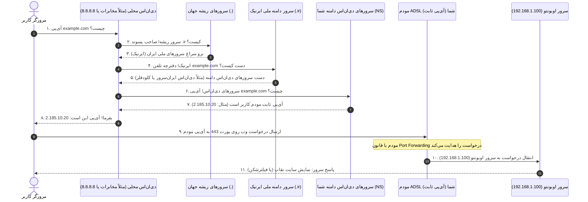
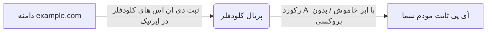

<style>
body, p, h1, h2, h3, h4, h5, h6, li, ul, ol {
  font-family: 'Segoe UI', Segoe, Tahoma, Geneva, Verdana, sans-serif !important;
  direction: rtl;
  text-align: right;
}
pre, code {
  direction: ltr;
  text-align: left;
}
.markdown-body table,
.markdown-preview-section table,
table {
  direction: rtl !important;
  text-align: right !important;
  width: 100%;
  border-collapse: collapse;
  margin-inline-start: 0;
  margin-inline-end: auto;
}
.markdown-body th,
.markdown-body td,
.markdown-preview-section th,
.markdown-preview-section td,
table thead th,
table tbody td,
table th,
table td {
  text-align: right !important;
  direction: rtl;
  vertical-align: top;
  padding: 0.35em 0.5em;
}
table td code,
table th code,
.markdown-body table td code,
.markdown-body table th code {
  direction: ltr;
  unicode-bidi: embed;
  text-align: right !important;
  display: inline-block;
}
.task-list-item input[type="checkbox"],
input.task-list-item-checkbox {
  margin: 0 0.5em 0 0 !important;
}
</style>

# سفر یک درخواست وب: چگونگی انتشار DNS و راهنمای اتصال دامنه example.com به سرور شما

تبریک می‌گویم! خرید و فعال‌سازی دامنه **`example.com`** اولین قدم بزرگ برای ساخت آن سایت نقاب شخصی و پایداری همیشگی سیستم شماست.

در این سند آموزشی، ابتدا به زبان بسیار ساده و داستان‌گونه بررسی می‌کنیم که وقتی کسی آدرس سایت شما را وارد می‌کند، چه مراحلی در شبکه طی می‌شود (سفر DNS)، سپس راهنمای گام‌به‌گام و عملی برای متصل کردن دامنه به سرور اوبونتو را ارائه می‌دهیم.

---

## ۱. سفر یک درخواست وب: از مرورگر کاربر تا سرور اوبونتوی شما 🌍

وقتی کاربر در خانه خود مرورگر را باز کرده و آدرس **`example.com`** را تایپ می‌کند، یک سفر شگفت‌انگیز در کسری از ثانیه در پهنای شبکه اینترنت رخ می‌دهد. 

کامپیوترها زبان متنی (مثل حروف الفبا) را نمی‌فهمند؛ آن‌ها فقط اعداد (آدرس‌های IP) را می‌فهمند. بنابراین اینترنت نیاز به یک **دفترچه تلفن بزرگ به نام DNS (Domain Name System)** دارد تا نام دامنه را به آی‌پی عمومی مودم شما ترجمه کند.

### 🗺️ نقشه مسیر سفر درخواست وب:



### 🗣️ تشریح گام‌ها به زبان ساده:

1. **پرسش اول (گام ۱):** مرورگر کاربر ابتدا از مخابرات یا شرکت اینترنتی خود (Local DNS) می‌پرسد: «آیا آی‌پی سایت `example.com` را داری؟» اگر قبلاً کسی آن را باز نکرده باشد، جواب منفی است.
2. **پرسیدن از سرورهای ریشه جهان (گام ۲ و ۳):** دی‌ان‌اس مخابرات به سراغ ۱۳ سرور اصلی و ریشه جهان (Root Servers) می‌رود و می‌پرسد: «پسوند `.ir` دست کیست؟» سرور ریشه می‌گوید: «دست سازمان **ایرنیک (IRNIC)** در ایران است.»
3. **پرسیدن از ایرنیک (گام ۴ و ۵):** دی‌ان‌اس مخابرات به سراغ سرورهای ایرنیک می‌رود و می‌پرسد: «صاحب دامنه `example.com` مدیریت دفترچه تلفن خود را به کدام شرکت سپرده است؟» ایرنیک پاسخ می‌دهد: «این دامنه به کارگزاری فلان (مثلاً ایران‌سرور یا کلودفلر) سپرده شده و آدرس کارگزاری‌ها (به نام **Nameservers / NS**) این است.»
4. **پرسیدن از کارگزار نهایی (گام ۶ و ۷):** دی‌ان‌اس مخابرات به سراغ کارگزار نهایی (مثلاً ایران‌سرور) رفته و می‌پرسد: «آی‌پی ثبت شده برای `example.com` چیست؟» کارگزار پاسخ می‌دهد: **«آی‌پی ثابت مودم شما (مثلاً `2.185.10.20`).»**
5. **ارسال درخواست اصلی (گام ۸ و ۹):** اکنون مرورگر کاربر آی‌پی عددی شما را دارد. مستقیم به سمت مودم ADSL شما در خانه/دفتر کار شلیک می‌کند!
6. **عبور از دروازه مودم (گام ۱۰ و ۱۱):** درخواست به مودم شما می‌رسد. مودم به جدول پورت فورواردینگ نگاه می‌کند: «هر درخواستی که روی پورت ۴۴۳ آمد را بفرست برای سرور اوبونتو به آی‌پی داخلی `192.168.1.100`». سرور اوبونتو درخواست را تحویل گرفته و سایت نقاب را به کاربر نشان می‌دهد.

---

## ۲. مفهوم انتشار دی‌ان‌اس (DNS Propagation) چیست؟ ⏳

وقتی شما آی‌پی سرور خود را برای دامنه ثبت می‌کنید، این اطلاعات فوراً در کل دنیا پخش نمی‌شوند.

### ❓ چرا زمان می‌برد؟
برای اینکه اینترنت سریع کار کند، تمام دی‌ان‌اس سرورهای دنیا (مثل مخابرات، همراه اول، گوگل و...) پاسخ‌ها را برای مدتی (مثلاً چند ساعت) در حافظه خود ذخیره می‌کنند (به این کار **Cache** می‌گویند) تا هر بار مجبور نشوند کل دنیا را برای یک سایت بچرخند. 

*   وقتی شما آی‌پی دامنه را تغییر می‌دهید، باید صبر کنید تا این حافظه موقت (کش) در تمام سرویس‌دهنده‌های اینترنت دنیا منقضی و پاک شود و آن‌ها دوباره از ایرنیک استعلام بگیرند.
*   برای دامنه‌های بین‌المللی (مثل `.com`) این فرآیند معمولاً چند دقیقه تا ۲ ساعت زمان می‌برد.
*   **برای دامنه‌های ملی ایران (`.ir`)، سرورهای ایرنیک فقط ۴ بار در روز (هر ۶ ساعت یک‌بار) جدول خود را آپدیت می‌کنند.** بنابراین اعمال تغییرات دی‌ان‌اس در دامنه‌های `.ir` ممکن است بین **۱۲ تا ۲۴ ساعت** طول بکشد!

---

## ۳. چطور دامنه example.com را به سرور متصل کنیم؟ (راهنمای عملی) 🛠️

برای متصل کردن دامنه به آی‌پی ثابت سرورتان، دو روش وجود دارد:

---

### روش اول: روش مستقیم و ساده با دی‌ان‌اس‌های ایران‌سرور (بدون کلودفلر)

اگر نمی‌خواهید از کلودفلر استفاده کنید، می‌توانید از پنل خود شرکت ایران‌سرور برای مدیریت دی‌ان‌اس استفاده کنید:

1. **یافتن آی‌پی ثابت عمومی مودم:**
   در سرور اوبونتو دستور زیر را بزنید تا آی‌پی ثابت اینترنتی مودم خود را ببینید:
   ```bash
   curl ifconfig.me
   ```
   *(فرض می‌کنیم آی‌پی خروجی شما `2.185.10.20` باشد).*
2. **ورود به پنل ایران‌سرور:**
   وارد سایت ایران‌سرور شده و به پرتال کاربری خود بروید.
3. **بخش مدیریت دامنه:**
   به بخش **«دامنه‌های من»** رفته و روی دامنه `example.com` کلیک کنید.
4. **بررسی کارگزارها (DNS):**
   مطمئن شوید دی‌ان‌اس‌های پیش‌فرض خود ایران‌سرور روی دامنه تنظیم باشند (مثلاً `ns1.iranserver.com` و `ns2.iranserver.com`).
5. **بخش مدیریت رکوردها (DNS Zones):**
   به بخش «مدیریت هاست» یا «دی‌ان‌اس زون» بروید و دو رکورد از نوع **A Record** بسازید:

| نوع رکورد (Type) | نام میزبان (Host / Name) | مقدار / آی‌پی (Value / Points to) | علت ساخت |
| :--- | :--- | :--- | :--- |
| **A** | `@` (یا خالی) | آی‌پی ثابت شما (مثلاً `2.185.10.20`) | برای باز شدن سایت با آدرس اصلی (`example.com`) |
| **A** | `www` | آی‌پی ثابت شما (مثلاً `2.185.10.20`) | برای باز شدن سایت با پیشوند www (`www.example.com`) |

---

### روش دوم: روش حرفه‌ای و منعطف با کلودفلر (Cloudflare) 🌌

کلودفلر بهترین کنترل پنل دی‌ان‌اس دنیا را دارد. تغییرات دی‌ان‌اس در کلودفلر در کمتر از **۱۰ ثانیه** اعمال می‌شوند (به جای ساعت‌ها انتظار!).



#### گام ۱: ثبت‌نام در کلودفلر
1. به سایت **[Cloudflare](https://www.cloudflare.com/)** بروید و یک اکانت رایگان بسازید.
2. روی دکمه **Add a Site** کلیک کنید و دامنه خود را وارد کنید: `example.com`
3. پلن **Free** (رایگان) را انتخاب کنید. کلودفلر دامنه را اسکن کرده و به شما ۲ آدرس سرور نام (Nameserver) می‌دهد (مثلاً: `ash.ns.cloudflare.com` و `bob.ns.cloudflare.com`).

#### گام ۲: ست کردن دی‌ان‌اس‌های کلودفلر در ایرنیک (بسیار مهم ⚠️)
1. وارد سایت ایرنیک (**[nic.ir](https://www.nic.ir/)**) شوید و با یوزر و پسورد خود لاگین کنید.
2. به بخش **«دامنه‌ها»** -> **«دامنه‌های من»** رفته و روی `example.com` کلیک کنید.
3. در پایین صفحه، روی دکمه **«ویرایش کارگزارها (DNS)»** کلیک کنید.
4. دو آدرس دی‌ان‌اس کلودفلر را در ردیف‌های ۱ و ۲ وارد کنید و دکمه ذخیره را بزنید.
5. **صبر کنید:** حدود ۱۲ الی ۲۴ ساعت طول می‌کشد تا ایرنیک این تغییر را تایید و در کل دنیا منتشر کند. پس از تایید، کلودفلر به شما ایمیل می‌زند که دامنه شما فعال شده است.

#### گام ۳: ثبت آی‌پی ثابت در کلودفلر برای فیلترشکن
پس از فعال شدن دامنه در کلودفلر:
1. در پنل کلودفلر به بخش **DNS** -> **Records** بروید.
2. روی دکمه **Add Record** کلیک کنید و مشخصات زیر را وارد کنید:

| Type | Name | IPv4 Address | Proxy Status (وضعیت ابر ⚠️) |
| :--- | :--- | :--- | :--- |
| **A** | `@` | آی‌پی ثابت شما (مثال: `2.185.10.20`) | **خاموش ⚪ (DNS Only)** |
| **A** | `www` | آی‌پی ثابت شما (مثال: `2.185.10.20`) | **خاموش ⚪ (DNS Only)** |

> [!IMPORTANT]
> **چرا پروکسی کلودفلر (ابر زرد 🟡) باید برای فیلترشکن خاموش باشد؟**
> اگر ابر کلودفلر روشن باشد، کلودفلر آی‌پی واقعی سرور شما را پشت آی‌پی‌های خودش پنهان می‌کند. این کار برای سایت‌های عادی عالی است، اما پروتکل **Reality** برای تبادل کلید‌های نامتقارن خود نیاز به اتصال **مستقیم و بدون واسطه** کلاینت به سرور شما دارد. اگر ابر کلودفلر روشن باشد، Reality کار نخواهد کرد. پس حتماً ابر را خاموش نگه دارید تا خاکستری/سفید شود.

حالا دامنه شما آماده است! هر زمان که دامنه به طور کامل منتشر شود، با وارد کردن `example.com` در مرورگر، مستقیم به مودم خودتان متصل خواهید شد.
