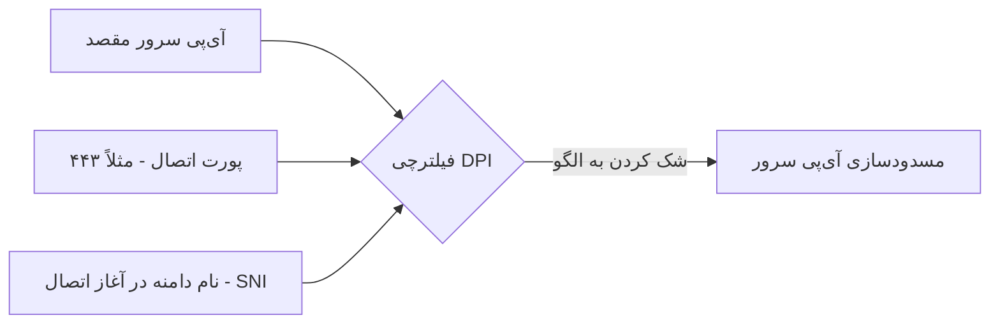

<style>
body, p, h1, h2, h3, h4, h5, h6, li, ul, ol {
  font-family: 'Segoe UI', Segoe, Tahoma, Geneva, Verdana, sans-serif !important;
  direction: rtl;
  text-align: right;
}
pre, code {
  direction: ltr;
  text-align: left;
}
.markdown-body table,
.markdown-preview-section table,
table {
  direction: rtl !important;
  text-align: right !important;
  width: 100%;
  border-collapse: collapse;
  margin-inline-start: 0;
  margin-inline-end: auto;
}
.markdown-body th,
.markdown-body td,
.markdown-preview-section th,
.markdown-preview-section td,
table thead th,
table tbody td,
table th,
table td {
  text-align: right !important;
  direction: rtl;
  vertical-align: top;
  padding: 0.35em 0.5em;
}
table td code,
table th code,
.markdown-body table td code,
.markdown-body table th code {
  direction: ltr;
  unicode-bidi: embed;
  text-align: right !important;
  display: inline-block;
}
.task-list-item input[type="checkbox"],
input.task-list-item-checkbox {
  margin: 0 0.5em 0 0 !important;
}
</style>

# کالبدشکافی زیرساخت فیلترینگ (GFW/DPI) و مکانیزم‌های نوین دور زدن آن

این سند به بررسی عمیق زیرساخت‌های سانسور اینترنت (دیوار آتش بزرگ / GFW)، مکانیزم‌های بازرسی بسته‌ها (DPI)، تکنولوژی مچ‌گیری ربات‌ها (Active Probing) و در نهایت فناوری انقلابی **Reality** و **سایت نقاب (Decoy Fallback)** می‌پردازد.

---

## ۱. دیوار آتش بزرگ و تکنولوژی DPI چطور کار می‌کند؟

سیستم‌های فیلترینگ قدیمی بر اساس مسدود کردن آی‌پی‌ها (IP Blocking) یا پورت‌ها عمل می‌کردند. اما فیلترینگ نوین از قابلیتی بسیار هوشمند به نام **DPI (Deep Packet Inspection / بازرسی عمیق بسته‌ها)** استفاده می‌کند.

### 🔍 فرآیند کار DPI به زبان ساده:
تصور کنید پستچی به جای اینکه فقط آدرس روی پاکت نامه را بخواند، نامه را باز کند، متن داخل آن را بخواند، نوع خط و زبان فرستنده را آنالیز کند و در صورتی که محتوای نامه را نپسندید، آن را پاره کند!

در پروتکل رمزنگاری استاندارد HTTPS، سه بخش وجود دارد که DPI می‌تواند آن‌ها را بخواند یا حدس بزند:



1. **آدرس آی‌پی (IP Address):** اگر آی‌پی سرور شما در لیست سیاه باشد، اتصال کلاً برقرار نمی‌شود.
2. **پورت اتصال (Port):** اگر پورت مشکوکی (مثل ۵۰۰۰۰) در حال رد و بدل کردن دیتای سنگین باشد، مسدود می‌شود.
3. **شناسه دامنه (SNI - Server Name Indication):** در پروتکل TLS (امنیت وب)، مرورگر کاربر در ابتدای اتصال و قبل از اینکه رمزنگاری شروع شود، مجبور است نام دامنه‌ای که می‌خواهد باز کند (مثلاً `www.youtube.com`) را به صورت **متن ساده و بدون رمزنگاری** ارسال کند تا سرور بفهمد کدام سایت را باید نشان دهد. فیلترچی (DPI) دقیقاً در همین ثانیه اول نام دامنه را می‌خواند و اگر فیلتر باشد، اتصال را فورا ریست (`Connection Reset`) می‌کند.

---

## ۲. ربات‌های مچ‌گیر فیلترچی: بررسی فعال (Active Probing)

زمانی که فیلترچی به یک آی‌پی مشکوک می‌شود اما نمی‌تواند ثابت کند که ترافیک عبوری متعلق به یک پروکسی است (چون داده‌ها رمزنگاری‌شده هستند)، از روشی به نام **بررسی فعال (Active Probing)** استفاده می‌کند.

> [!TIP]
> **مطالعه تفصیلی بررسی فعال و سد Reality:**
> برای آشنایی عمیق با حملات بررسی فعال، تمثیل مامور لباس شخصی صنف، تکنیک ارسال کدهای مخرب و نحوه احراز هویت یکبار مصرف Reality، لطفاً سند تخصصی **[کالبدشکافی بررسی فعال (Active Probing) و دفاع نفوذناپذیر پروتکل Reality](./09-active-probing-detection.md)** را مطالعه کنید.

### 🤖 سناریوی بررسی فعال به زبان ساده:
ربات‌های فیلترچی با لباس مبدل (درخواست‌های متفرقه وب) به پورت سرور شما متصل می‌شوند. اگر سرور شما رفتاری غیرعادی داشته باشد یا خطاهای ویژه پروکسی بدهد، فوراً مسدود می‌شود. اما پروتکل **Reality** به زیبایی این درخواست‌های ناشناس را شناسایی کرده و آن‌ها را مستقیماً به سایت نقاب هدایت می‌کند!

---

## ۳. فناوری Reality چطور این سد را می‌شکند؟

پروتکل **Reality** (که بر پایه VLESS توسعه یافته) انقلابی‌ترین روش برای خنثی کردن DPI و Active Probing بدون نیاز به خرید گواهینامه SSL یا دامنه‌های گران‌قیمت است.

### 🛠️ مکانیزم فنی Reality:
1. **دزدی هویت سایت‌های معروف:** وقتی گوشی کلاینت می‌خواهد به سرور شما وصل شود، ## ۵. راهکار نهایی و مسدود‌نشدنی: سایت نقاب و معماری Fallback

برای اینکه امنیت سرور را به سطح ۱۰۰٪ برسانید و جلوی هرگونه مسدودسازی را بگیرید، باید از **سایت نقاب (Decoy Website)** و مکانیزم **Fallback (بازگردانی)** استفاده کنید.

> [!TIP]
> **مطالعه تفصیلی تکنیک نقاب و Fallback:**
> برای بررسی موشکافانه نحوه فریب دادن بازرسان عمیق شبکه، تمثیل کتاب‌فروشی دنج با درگاه مخفی پشتی و نحوه مدیریت ترافیک‌های ورودی ربات‌های فیلترچی، حتماً سند جامع **[راهنمای جامع معماری سایت نقاب و تکنیک بازگردانی (Decoy & Fallback)](./08-decoy-site-and-fallback.md)** را مطالعه کنید.

### 📐 ساختار فیزیکی Fallback:
در این روش، شما به جای تقلید از مایکروسافت، از **دامنه اختصاصی و تمیز خودتان** (بدون فیلتر) استفاده می‌کنید:

```mermaid
graph TD
    User[کاربر یا ربات فیلترچی] -->|پورت 443| Xray{هسته Xray سرور اوبونتو}
    Xray -->|درخواست حاوی کلید فیلترشکن| Proxy[برقراری اینترنت آزاد اینترنت دوم آزاد (بدون فیلتر)]
    Xray -->|درخواست متفرقه یا ربات مچ گیر| WebServer[وب سرور داخلی Nginx پورت 8080]
    WebServer --> DecoySite[نمایش وب سایت واقعی مدیریت پروژه یا اشتراک فایل]
```

وقتی کاربر واقعی با کلید خصوصی معتبر Reality به پورت ۴۴۳ سرور وصل شود، Xray اتصال اینترنت آزاد را برای او برقرار می‌سازد. اما اگر یک ربات مچ‌گیر یا یک فرد عادی به آی‌پی سرور متصل شود، به دلیل نداشتن کلید معتبر، Xray درخواست او را به وب‌سرور داخلی Nginx روی پورت ۸۰۸۰ می‌فرستد تا سایت نقاب کاری به او نشان داده شود و سرور شما ۱۰۰٪ امن بماند.�فاده کرد؟

بسیاری از مدیران سرور به اشتباه از دامنه‌های گوگل (`google.com`) برای Reality استفاده می‌کنند، در حالی که این کار سرور را به سرعت به باد می‌دهد!

*   **دلیل اول: پروتکل‌های اختصاصی گوگل ⚡**
    گوگل از پروتکل‌های به شدت سفارشی‌سازی شده و پیچیده‌ای مثل **gQUIC** و **HTTP/3** روی بستر UDP استفاده می‌کند. Reality برای کارکرد خود نیاز به پروتکل استاندارد TCP و لایه TLS عادی دارد. عدم انطباق پروتکل Reality با پروتکل‌های واقعی سرورهای گوگل، فوراً توجه سیستم‌های DPI گوگل و فیلترچی را جلب کرده و منجر به قطع اتصال می‌شود.
*   **دلیل دوم: حساسیت شدید روی رنج‌های آی‌پی گوگل (ASN) 🗺️**
    رنج آی‌پی‌های سرورهای گوگل در کل دنیا کاملاً ثبت‌شده و مشخص است. سیستم فیلترینگ ایران (GFW) تمام دامنه‌های گوگل را می‌شناسد. وقتی DPI ببیند ترافیکی با شناسه دامنه `google.com` به جای اینکه به سمت دیتاسنترهای رسمی گوگل هدایت شود، به سمت آی‌پی یک مودم ADSL خانگی یا یک VPS کوچک در اروپا می‌رود، بلافاصله متوجه جعل هویت شده و سرور شما را مسدود می‌کند.

---

## ۵. راهکار نهایی و مسدود‌نشدنی: سایت نقاب و معماری Fallback

برای اینکه امنیت سرور را به سطح ۱۰۰٪ برسانید، باید از **سایت نقاب (Decoy Website)** و مکانیزم **Fallback (بازگردانی)** استفاده کنید.

### 📐 ساختار فیزیکی Fallback:
در این روش، شما به جای تقلید از مایکروسافت، از **دامنه اختصاصی و تمیز خودتان** (بدون فیلتر) استفاده می‌کنید.

```mermaid
graph TD
    User[کاربر یا ربات فیلترچی] -->|پورت 443| Xray{هسته Xray سرور اوبونتو}
    Xray -->|درخواست حاوی کلید فیلترشکن| Proxy[برقراری اینترنت آزاد اینترنت دوم آزاد (بدون فیلتر)]
    Xray -->|درخواست متفرقه یا ربات مچ گیر| WebServer[وب سرور داخلی Nginx پورت 8080]
    WebServer --> DecoySite[نمایش وب سایت واقعی مدیریت پروژه یا اشتراک فایل]
```

1. **درخواست فیلترشکن معتبر:** کاربر شما با برنامه گوشی (حاوی کلید خصوصی فیلترشکن) به پورت ۴۴۳ وصل می‌شود. Xray کلید را شناسایی کرده و اینترنت آزاد اینترنت دوم آزاد (بدون فیلتر) را به او تحویل می‌دهد.
2. **درخواست ربات فیلترچی یا فرد عادی:** یک ربات یا فرد عادی آی‌پی یا دامنه شما را در مرورگر می‌زند. از آنجا که او فاقد کلید فیلترشکن است، Xray به صورت کاملاً خودکار و در پس‌زمینه، درخواست او را به **وب‌سرور داخلی Nginx** که روی پورت `8080` فعال است می‌فرستد.
3. **نتیجه:** ربات فیلترچی یک سایت کاملاً واقعی، با سرعت بالا و عکس‌ها و ویدئوهای کاری می‌بیند. او گزارش می‌دهد که این آی‌پی متعلق به یک سرور اداری مجاز است و سرور شما برای همیشه فعال و سالم باقی می‌ماند.

---

## ۶. در زیرساخت شبکه فیلترشده، چه چیزهایی «غیرقابل فیلتر» هستند؟

حکومت‌ها برای بقای اقتصادی و اداری خود مجبورند بخش‌هایی از اینترنت جهانی را باز بگذارند. این‌ها همان روزنه‌های عبور ما هستند:

| نوع سرویس / پروتکل | علت غیرقابل فیلتر بودن 🛡️ | نحوه بهره‌برداری فیلترشکن‌ها |
| :--- | :--- | :--- |
| **پورت ۴۴۳ (HTTPS)** | مسدود کردن آن کل بانکداری الکترونیک، خریدهای آنلاین و دسترسی به تمام سایت‌های جهان را متوقف می‌کند. | فیلترشکن‌های نوین (Reality) کدهای خود را داخل ترافیک پورت ۴۴۳ پنهان می‌کنند. |
| **ترافیک TLS 1.3** | آخرین استاندارد جهانی امنیت وب. مسدود کردن آن باعث از کار افتادن مرورگرها و دسترسی به وب‌سایت‌های مدرن می‌شود. | تمام فرآیند تبادل کلید فیلترشکن در قالب دست‌دهی TLS 1.3 شبیه‌سازی می‌شود. |
| **VPNهای سازمانی (IPsec/WireGuard)** | سفارتخانه‌ها، بانک‌های بین‌المللی و شرکت‌های تجاری بزرگ برای امنیت تبادل دیتای شعب خود به آن‌ها نیاز دارند. | فیلترچی فقط فیلترشکن‌های تجاری عمومی را مسدود می‌کند و با VPNهای اختصاصی کاری ندارد. |
| **ترافیک سرور به سرور (Database Sync)** | دیتاسنترهای داخلی برای پشتیبان‌گیری و همگام‌سازی خدمات با سرورهای خارجی باید ارتباط مستقیم داشته باشند. | در روش‌های «تونل‌زنی»، ترافیک کاربران از سرور ایران به سرور خارج به عنوان ترافیک دیتابیس همگام‌سازی‌شده رد می‌شود. |

با درک این قوانین و بهره‌گیری از معماری‌های پیشرفته‌ای مثل **VLESS + Reality + Decoy Fallback** روی **بستر Dual-WAN فیزیکی شما**، یک زیرساخت فیلترشکن خانگی/شرکتی ساخته شده است که از نظر امنیت و پایداری شبکه با پیشرفته‌ترین سیستم‌های سازمانی دنیا برابری می‌کند. 🚀
