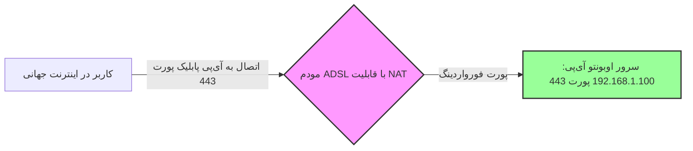

# راهنمای جامع پورت فورواردینگ (Port Forwarding) و ساختار درگاه‌های شبکه 🚪

هدف این سند، کالبدشکافی مفهوم پورت فورواردینگ، نقش NAT در مسیریاب‌ها، تفاوت آی‌پی‌های عمومی/خصوصی و چگونگی هدایت امن ترافیک از شبکه جهانی اینترنت به دستگاه‌های محلی (مانند سرور اوبونتو) است.

---

## 🏛️ ۱. تمثیل عامیانه: کارمند پذیرش و شماره داخلی‌های شرکت

تصور کنید می‌خواهید با یکی از کارمندان یک شرکت بزرگ اداری به نام **«پیمان»** تماس بگیرید:
*   شرکت فقط **یک شماره تلفن رسمی و عمومی** دارد که روی تابلوی بیرون نوشته شده است (مثال: `021-88888888`). این شماره معادل **آی‌پی پابلیک (Public IP)** مودم شماست.
*   پیمان در یک اتاق خاص نشسته و خط تلفن او **شماره داخلی اختصاصی** خود را دارد (مثال: داخلی `443`). این شماره داخلی معادل **پورت (Port)** است.
*   شما نمی‌توانید مستقیم از بیرون خانه با تلفن داخلی پیمان تماس بگیرید. ابتدا باید شماره عمومی شرکت را شماره‌گیری کنید.
*   وقتی با شماره اصلی تماس می‌گیرید، **منشی پذیرش** (که معادل **مودم/روتر** است) گوشی را برمی‌دارد. شما می‌گویید: «لطفاً من را به داخلی ۴۴۳ وصل کنید.» منشی پذیرش درخواست شما را می‌گیرد و خط شما را به اتاق پیمان هدایت می‌کند.

**پورت فورواردینگ دقیقاً همین کار است!** شما به مودم خود دستور می‌دهید که: *«هر زمان ترافیکی از اینترنت جهانی روی فلان شماره درگاه آمد، آن را فوراً به سرور مشخص ما در شبکه داخلی وصل کن.»*

---

## 🌐 ۲. تفاوت آی‌پی پابلیک و پرایوت (مفهوم NAT)

در اینترنت دو نوع آدرس آی‌پی وجود دارد:

### الف) آی‌پی پرایوت (Private IP):
آدرس‌هایی هستند که فقط داخل خانه یا شرکت شما معنی دارند (مثال: `192.168.1.100`). دستگاه‌های دیگر در اینترنت جهانی نمی‌توانند این آدرس‌ها را ببینند یا مستقیماً به آن‌ها داده ارسال کنند (مثل شماره اتاق‌های داخلی یک شرکت).

### ب) آی‌پی پابلیک (Public IP):
آدرس شناسنامه‌ای و جهانی مودم شما در اینترنت است که توسط شرکت ارائه‌دهنده اینترنت (ISP) به شما داده می‌شود. تمام جهان این آدرس را می‌بینند.

### 🔄 مکانیسم NAT (ترجمه آدرس شبکه):
مودم شما از مکانیزمی به نام **NAT (Network Address Translation)** استفاده می‌کند. وقتی گوشی شما می‌خواهد سایتی را باز کند، NAT آدرس پرایوت گوشی را به آی‌پی پابلیک مودم ترجمه می‌کند و درخواست را به اینترنت می‌فرستد. وقتی پاسخ آمد، آن را دوباره ترجمه کرده و به گوشی شما تحویل می‌دهد.

---

## 🚪 ۳. پورت فورواردینگ (Port Forwarding) چیست؟

مکانیسم NAT به صورت پیش‌فرض یک‌طرفه است؛ یعنی دستگاه‌های داخل خانه می‌توانند به اینترنت وصل شوند، اما دستگاه‌های خارج از خانه (کلاینت‌های فیلترشکن شما) نمی‌توانند سرور شما را در خانه پیدا کنند!

برای حل این چالش، ما **پورت فورواردینگ (یا Virtual Server)** را روی مودم تعریف می‌کنیم:

وقتی یک کاربر خارج از شبکه می‌خواهد به فیلترشکن متصل شود:
1. اپلیکیشن گوشی کاربر به **آی‌پی پابلیک ثابت مودم شما روی پورت ۴۴۳** متصل می‌شود.
2. مودم به جدول پورت فورواردینگ خود نگاه می‌کند:
   > *"هر بسته‌ای روی پورت ۴۴۳ آمد را به آی‌پی داخلی `192.168.1.100` روی پورت `443` بفرست."*
3. مودم بسته را بدون تغییر به سرور اوبونتوی شما تحویل می‌دهد و اتصال فیلترشکن برقرار می‌شود.

---

## ⚙️ ۴. نحوه پیکربندی پورت فورواردینگ در مودم‌ها

فرآیند تنظیم پورت فورواردینگ در اکثر مودم‌ها بسیار مشابه است:

1. مرورگر خود را باز کنید و آی‌پی مدیریت مودم را بزنید (معمولاً `192.168.1.1` یا `192.168.0.1`).
2. نام کاربری و پسورد مودم را وارد کنید (معمولاً پشت مودم نوشته شده یا هر دو `admin` هستند).
3. به بخش تنظیمات پیشرفته (Advanced) بروید و به دنبال گزینه‌هایی مانند **NAT**، **Port Forwarding**، **Virtual Server** یا **Port Mapping** بگردید.
4. جدول قوانین جدید را باز کرده و فیلدها را مطابق جدول زیر پر کنید:

| نام فیلد در مودم | مقدار تنظیمی نمونه | علت فنی 🔒 |
| :--- | :--- | :--- |
| **Application Name / Service** | نام دلخواه (مثلاً `xray-ssl`) | فقط برای شناسایی قانون توسط شما. |
| **Protocol** | **`TCP`** یا **`ALL`** | پروتکل Reality بر پایه TCP کار می‌کند؛ پس حتماً باید عبور داده شود. |
| **External Port** | **`443`** | پورتی که کلاینت‌ها از سراسر اینترنت به آن متصل می‌شوند. |
| **Internal Port** | **`443`** | پورتی که سرور اوبونتو روی آن منتظر دریافت ترافیک است. |
| **Internal IP Address** | **`192.168.1.100`** | آی‌پی ثابت داخلی سرور اوبونتوی شما. |

---

## 🛡️ ۵. چالش‌های امنیتی و راهکارهای طلایی

باز کردن پورت‌های مودم به سمت اینترنت جهانی، مانند باز کردن یک پنجره کوچک به بیرون از خانه است. برای اینکه از امنیت ۱۰۰ درصدی سیستم مطمئن باشید، رعایت دو اصل زیر الزامی است:

*   **فقط پورت‌های ضروری را باز کنید:** هرگز پورت‌های حساسی مثل **پورت ۲۲ (SSH)** سرور را روی مودم فوروارد نکنید! فیلترچی و هکرها به طور مداوم پورت‌های ۲۲ کل دنیا را اسکن می‌کنند تا با حملات حدس پسورد (Brute Force) وارد سرورها شوند. اگر نیاز به مدیریت سرور از بیرون دارید، از روش‌های تونل امن استفاده کنید.
*   **ثابت نگه داشتن آی‌پی داخلی سرور:** اگر مودم شما خاموش و روشن شود و آی‌پی سرور اوبونتو از `192.168.1.100` به `192.168.1.101` تغییر کند، پورت فورواردینگ شما بلافاصله خراب خواهد شد! برای جلوگیری از این مشکل، حتماً از ویژگی **رزرو آی‌پی (DHCP Reservation)** در پنل مودم استفاده کنید تا بر اساس مک‌آدرس کارت شبکه سرور، آی‌پی آن همیشه ثابت بماند.

---

### 🎓 دوره یادگیری شبکه و فیلترینگ شما:
*   **[⬅️ درس بعدی: معماری سایت نقاب و تکنیک بازگردانی (Decoy Fallback)](./08-decoy-site-and-fallback.md)**
*   **[➡️ درس قبلی: راهنمای کامل نصب و راه‌اندازی سرور دوگانه ۳x-ui](./06-setup-3x-ui-server.md)**
