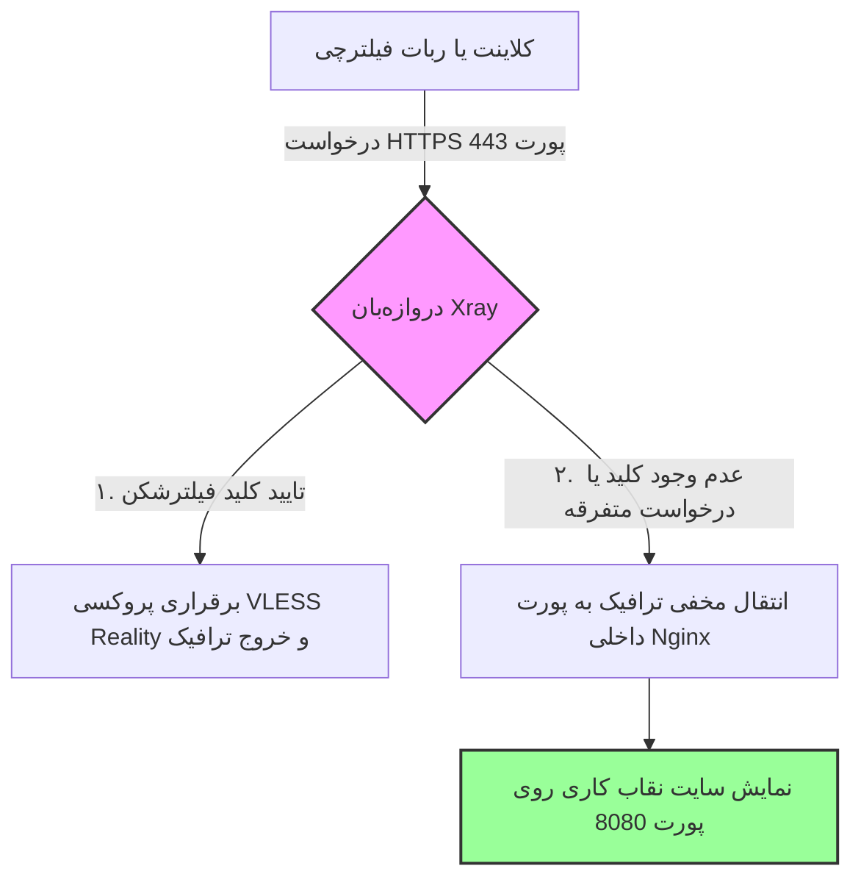

<style>
body, h1, h2, h3, h4, h5, h6, ul, ol {
    font-family: 'Segoe UI', Segoe, Tahoma, Geneva, Verdana, sans-serif !important;
    direction: rtl;
    text-align: right;
}
p, li, td, th {
    font-family: 'Segoe UI', Segoe, Tahoma, Geneva, Verdana, sans-serif !important;
    direction: rtl !important;
    text-align: right !important;
}
pre, code { direction: ltr; text-align: left; }
table {
    width: 100%;
    border-collapse: collapse;
    margin: 20px 0;
    direction: rtl;
}
th, td { border: 1px solid #ddd; padding: 12px; }
th { background-color: #f9f9f9; font-weight: bold; }
</style>

# راهنمای جامع معماری سایت نقاب و تکنیک بازگردانی (Decoy Website & Fallback) 🎭

هدف این سند، بررسی دقیق پیشرفته‌ترین دیوار امنیتی فیلترشکن‌ها یعنی **«سایت نقاب»**، معماری فنی **تکنیک بازگردانی (Fallback)** و نحوه گول زدن بازرسان عمیق شبکه (DPI) است.

---

## 🏛️ ۱. تمثیل عامیانه: کتاب‌فروشی دنج و کارگاه مخفی پشت قفسه‌ها

تصور کنید شما سرپرست یک تشکل علمی/کارگاهی مخفی و تخصصی هستید و می‌خواهید اعضای گروه بدون جلب توجه پلیس یا بازرسان به کارگاه شما رفت‌وآمد کنند:
*   شما یک مغازه بزرگ در حاشیه خیابان اجاره می‌کنید و تابلوی **«کتاب‌فروشی گلستان»** را روی آن نصب می‌کنید. ویترین مغازه را پر از کتاب‌های شعر و رمان‌های قانونی می‌کنید. این ویترین و قفسه‌های جلویی همان **سایت نقاب (Decoy Site)** شماست.
*   یک بازرس یا رهگذر عادی که درِ مغازه را باز می‌کند، چیزی جز یک کتاب‌فروشی آرام با کتاب‌های چیده شده نمی‌بیند. او مطمئن می‌شود که اینجا یک کسب‌وکار کاملاً قانونی است و مغازه را ترک می‌کند.
*   اما اعضای واقعی کارگاه شما، یک **«ضربه یا اسم رمز مخفی»** دارند (که معادل **کلید خصوصی فیلترشکن** است). وقتی عضو گروه وارد مغازه می‌شود و اسم رمز را می‌گوید، منشی قفسه بزرگ کتاب را به کنار می‌کشد و او را به **کارگاه مخفی پشتی** (که معادل **پروکسی و اینترنت آزاد** است) هدایت می‌کند.

**سیستم سایت نقاب و تکنیک Fallback دقیقاً بر اساس همین سناریو کار می‌کند!**

---

## 📐 ۲. تکنیک بازگردانی (Fallback) در هسته Xray چیست؟

وقتی شما فیلترشکن Reality را راه‌اندازی می‌کنید، پورت اصلی و خارجی سرور شما یعنی **`443`** در اختیار هسته نرم‌افزاری **Xray** قرار می‌گیرد. 

سایت‌های عادیHTTPS بر روی همین پورت ۴۴۳ کار می‌کنند. وقتی درخواستی به این پورت می‌رسد، نرم‌افزار Xray مانند یک دروازه‌بان فوق‌هوشمند عمل می‌کند:



### ۱. اگر درخواست حاوی کلید فیلترشکن شما باشد:
اپلیکیشن گوشی کاربر (مانند v2rayNG) با فرستادن کدهای هگزادسیمال Reality اعتبار خود را ثابت می‌کند. Xray کلید را تایید کرده و کاربر را به بستر اینترنت آزاد هدایت می‌کند.

### ۲. اگر درخواست بدون کلید باشد (ربات فیلترچی یا فرد غریبه):
فیلترچی برای مچ‌گیری از سرور شما، یک درخواست مرورگر عادی به آی‌پی شما می‌فرستد. چون او فاقد کلید خصوصی Reality شماست، Xray به صورت کاملاً بی‌صدا و بدون اینکه هیچ خطایی صادر کند، درخواست او را به **وب‌سرور داخلی Nginx که روی پورت ۸۰۸۰ فعال است** هدایت (Fallback) می‌کند. Nginx نیز یک وب‌سایت کاملاً واقعی و تمیز را به ربات نشان می‌دهد!

---

## 🛡️ ۳. مزیت‌های حیاتی استفاده از سایت نقاب اختصاصی

بسیاری از افراد به جای ساخت سایت نقاب شخصی، درخواست‌ها را به سایت‌های معروفی مثل مایکروسافت هدایت می‌کنند. اما راه‌اندازی یک سایت نقاب اختصاصی مزایای فوق‌العاده‌ای دارد:

*   **خنثی‌سازی کامل بازرسی فعال (Active Probing):** ربات فیلترچی اگر پس از اسکن پورت ۴۴۳ شما با یک سایت مدیریت پروژه یا سیستم شخصی فعال با دکمه‌ها و لینک‌های واقعی مواجه شود، در عرض چند میلی‌ثانیه آی‌پی شما را به عنوان یک سرور کاربری مجاز طبقه‌بندی کرده و مسدود نمی‌کند.
*   **عادی‌سازی الگوهای ترافیکی (Traffic Camouflage):** وقتی ترافیک کلان و حجم بالای مصرف داده‌ها روی دامنه شخصی شما ثبت شود، فیلترچی فکر می‌کند این ترافیک طبیعی و حاصل دانلود/آپلود فایل‌های کاری یا سازمانی روی وب‌سایت شماست.
*   **رفع خطاهای مشکوک شبکه‌ای:** بدون سایت نقاب، ربات‌های مچ‌گیر هنگام اسکن سرور با خطاهایی مثل `Connection Refused` یا کدهای خطای دست‌ساز Xray روبرو می‌شوند که مثل یک چراغ چشم‌زن قرمز، نشان‌دهنده حضور فیلترشکن روی سرور است.

---

## 🛠️ ۴. راهنمای طراحی و راه‌اندازی یک سایت نقاب فوق‌امن

برای اینکه سایت نقاب شما کاملاً واقعی و غیرقابل ردیابی به نظر برسد، رعایت اصول طراحی زیر توصیه می‌شود:

1.  **نوع کاربری سایت:** دامنه‌ای ثبت کنید و روی آن یک سیستم ساده، سبک اما با ظاهر کاملاً طبیعی بالا بیاورید. مواردی مثل:
    *   یک پورتال ساده مدیریت پروژه (همراه با فرم لاگین).
    *   یک گالری عکس شخصی یا رزومه کاری مهندسی.
    *   یک سایت ساده اشتراک ویدئو یا مستندات آموزشی محلی.
2.  **استفاده از سیستم محتوای استاتیک (HTML/CSS):** سایت نقاب شما باید بسیار سریع بارگذاری شود تا ربات فیلترچی متوجه هیچ سربار پردازشی یا تاخیری در بالا آمدن صفحات نشود. استفاده از قالب‌های استاتیک HTML بهترین انتخاب است.
3.  **پنهان‌سازی از موتورهای جستجو:** شما نمی‌خواهید سایت نقاب شخصی شما در نتایج سرچ گوگل بالا بیاید تا کاربران عادی اینترنت سر بزنند! برای این کار، یک فایل به نام `robots.txt` در پوشه روت سایت خود بسازید و کدهای زیر را برای عدم خزش موتورهای جستجو قرار دهید:
    ```text
    User-agent: *
    Disallow: /
    ```

---

### 🎓 دوره یادگیری شبکه و فیلترینگ شما:
*   **[⬅️ درس بعدی: بررسی فعال فیلترچی و سد پولادین Reality](./09-active-probing-detection.md)**
*   **[➡️ درس قبلی: راهنمای جامع پورت فورواردینگ و درگاه‌های شبکه](./07-port-forwarding.md)**
