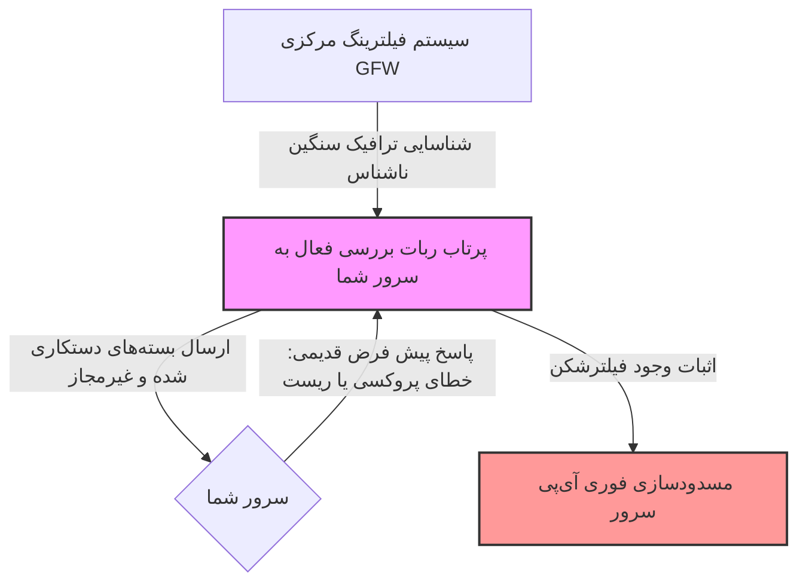

# کالبدشکافی بررسی فعال (Active Probing) و دفاع نفوذناپذیر پروتکل Reality 🛡️

هدف این سند، تحلیل مکانیزم کشف هوشمند پروکسی‌ها توسط سیستم‌های فیلترینگ با روش **«بررسی فعال»** و فناوری دفاعی فوق‌پیشرفته **پروتکل Reality** برای خنثی‌سازی کامل این حملات است.

---

## 🏛️ ۱. تمثیل عامیانه: مامور صنف با لباس شخصی و سوال‌های انحرافی

تصور کنید یک مغازه عتیقه‌فروشی در شهر وجود دارد که به صورت مخفیانه و بدون مجوز، کالاهای کمیاب وارداتی نیز می‌فروشد:
*   سازمان تعزیرات و صنف (معادل **فیلترچی / GFW**) به این مغازه مشکوک شده است. اما چون تمام بسته‌ها و کالاهای مغازه کادوپیچ و قفل شده‌اند، ماموران با نگاه کردن معمولی به مغازه نمی‌توانند جرم را ثابت کنند.
*   برای مچ‌گیری، سازمان یک **«مامور مخفی با لباس شخصی»** (معادل **ربات بررسی فعال / Active Probing**) را به عنوان مشتری به مغازه می‌فرستد.
*   مامور مخفی وارد مغازه می‌شود و شروع به پرسیدن سوالات انحرافی و عجیب می‌کند: «آیا فلان مجسمه عتیقه خاص را دارید؟»، «اگر من این پول سنگین را بدهم چطور؟» یا درخواست‌های غیرمعمولی می‌دهد.
*   اگر صاحب مغازه هول شود، رفتاری مشکوک نشان دهد، یا به سوالات انحرافی پاسخ‌های نادرست بدهد (معادل **خطاهای شبکه‌ای لو دهنده پروکسی**)، مامور فوراً بی‌سیم می‌زند و مغازه پلمب (آی‌پی مسدود) می‌شود!
*   اما اگر مغازه‌دار کاملاً حرفه‌ای باشد، کدهای شناسایی مشتریان صمیمی‌اش را بشناسد و با دیدن مامور ناشناس، مثل یک مشتری معمولی با او برخورد کند و فقط فاکتورهای رسمی و کتاب‌های مجاز مغازه را به او نشان دهد، مامور با دست خالی مغازه را ترک می‌کند.

**این سناریو، دقیقاً نبرد بین ربات‌های مچ‌گیر فیلترچی و پروتکل Reality است!**

---

## 🤖 ۲. بررسی فعال (Active Probing) چیست و فیلترچی چطور مچ می‌گیرد؟

در گذشته، فیلترچی فقط ترافیک عبوری را نگاه می‌کرد (شنود غیرفعال). اما امروزه، وقتی سیستم فیلترینگ متوجه عبور حجم سنگینی از داده‌های رمزنگاری‌شده و ناشناخته به سمت یک آی‌پی می‌شود، بلافاصله فاز **بررسی فعال (Active Probing)** را کلید می‌زند:

1. **ارسال بسته‌های شبیه‌سازی شده:** ربات فیلترچی بسته‌هایی شبیه به دست‌دهی‌های قدیمی پروکسی‌ها به پورت باز سرور شما می‌فرستد.
2. **پاسخ سرورهای معمولی:** سرورهای فیلترشکن قدیمی (مثل تروجان یا VLESS بدون حفاظ) با دریافت این بسته‌های نامعتبر، رفتاری غیرعادی نشان می‌دادند؛ مثلاً فوراً اتصال را قطع می‌کردند، خطای خاص پروتکل را برمی‌گرداندند یا داده‌های متفاوتی می‌فرستادند.
3. **مچ‌گیری:** ربات با آنالیز این رفتار تفاوت وب‌سایت واقعی و فیلترشکن را فهمیده و سرور را فیلتر می‌کرد.

---

## 🛡️ ۳. سد پولادین Reality در برابر بررسی فعال

پروتکل انقلابی **Reality** برای مقابله با این اسکن‌های مخرب، از دو ویژگی بی‌نظیر استفاده می‌کند:

### ۱. احراز هویت با کلید نامتقارن یکبار مصرف (Zero-RTT Auth)
وقتی کاربر واقعی شما می‌خواهد وصل شود، بسته‌ای می‌فرستد که با **کلید عمومی سرور Reality** شما قفل شده است. سرور با کلید خصوصی خود آن را باز می‌کند.
اگر ربات فیلترچی بخواهد ترافیک کپی شده یا بسته‌های جعلی بفرستد، چون فاقد کلید است، سرور Reality متوجه عدم اعتبار او می‌شود.

### ۲. تکنیک فوروارد بدون سرنخ (Direct Forwarding)
نقطه عطف Reality اینجاست: وقتی سرور متوجه می‌شود بسته ارسالی متعلق به یک ربات فیلترچی است، به هیچ وجه خطای فیلترشکن صادر نمی‌کند! 
بلکه درخواست ربات را مستقیماً به سمت **سایت نقاب معتبر خارجی** (مثلاً مایکروسافت) یا **سایت نقاب شخصی** شما هدایت می‌کند. 

ربات فیلترچی از پورت ۴۴۳ سرور شما پاسخ رسمی، تاییدیه SSL معتبر و فایل‌های HTML سایت شبیه‌سازی شده را دریافت می‌کند! ربات فکر می‌کند با سرور رسمی مایکروسافت یا یک پورتال اداری کاملاً قانونی در حال مکالمه است و پرونده اسکن را به عنوان «آی‌پی سالم» می‌بندد.

---

## 🔑 ۴. نقش کلیدهای کوتاه (Short IDs) در امنیت کلاینت‌ها

در تنظیمات Reality پنل ۳x-ui، فیلدی به نام **Short IDs** وجود دارد. این فیلد شناسه‌های دسترسی هگزادسیمال متفاوتی را تولید می‌کند.

*   **فیلتر محافظتی نهایی:** هر دستگاه کاربر با یکی از این Short IDها به سرور وصل می‌شود.
*   **جلوگیری از حملات بازپخش (Replay Attacks):** حتی اگر فیلترچی بتواند یک بسته رمزنگاری‌شده قدیمی از اتصال کاربر شما را در شبکه ذخیره کند و بعداً آن را به سرور شما بفرستد تا پاسخ سرور را تست کند، سرور Reality به دلیل منقضی شدن یا تغییر دوره Short ID، بسته فیلترچی را نامعتبر تشخیص داده و او را مستقیماً به سایت نقاب شوت می‌کند!

---

### 🎓 دوره یادگیری شبکه و فیلترینگ شما:
*   **[⬅️ درس بعدی: دیوار آتش DPI و فرار از سانسور](./05-gfw-and-evasion-mechanisms.md)**
*   **[➡️ درس قبلی: معماری سایت نقاب و تکنیک بازگردانی (Decoy Fallback)](./08-decoy-site-and-fallback.md)**
