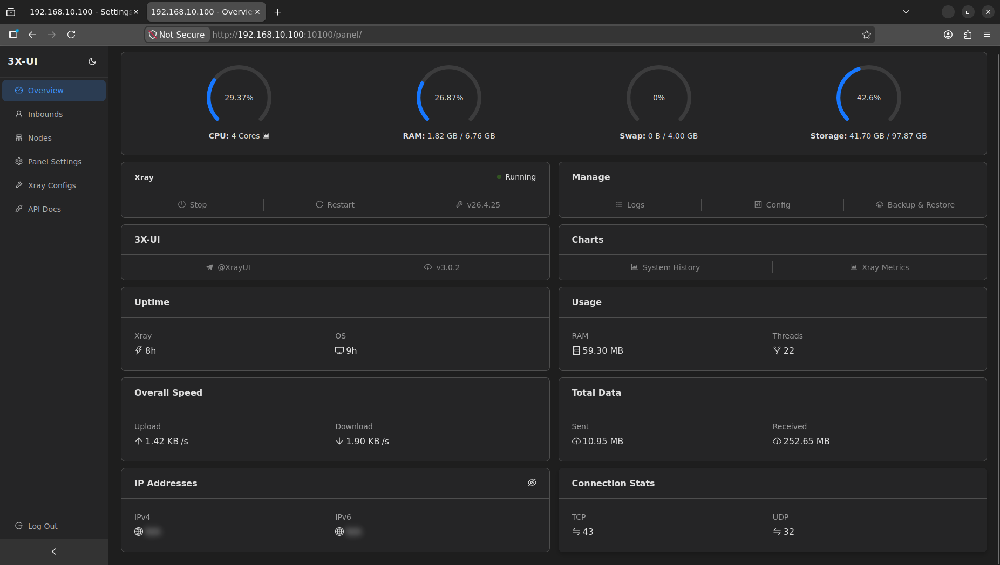
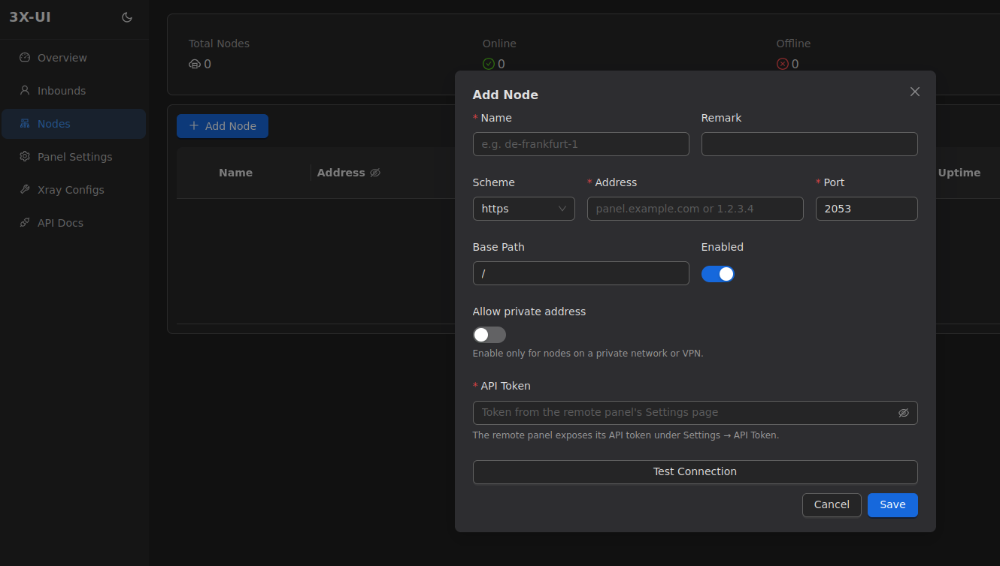

# راهنمای جامع بخش داشبورد و گره‌ها (Dashboard & Nodes) در 3x-ui

> **تمثیل کاربردی:** داشبورد پنل 3x-ui مانند یک **برج مراقبت فرودگاه** است. شما در این بخش می‌توانید به صورت لحظه‌ای (Real-time) وضعیت سلامت باند پرواز (منابع سرور مانند پردازنده و رم)، تعداد هواپیماهای در حال پرواز (اتصالات فعال TCP/UDP) و مجموع بارهای جابجا شده (ترافیک مصرفی) را زیر نظر بگیرید تا از صحت عملکرد کل سیستم اطمینان حاصل کنید.

## نگاهی به داشبورد و آمار سیستم (Dashboard Overview)

داشبورد اصلی پنل، اولین صفحه‌ای است که پس از ورود با آن مواجه می‌شوید و حیاتی‌ترین اطلاعات سلامت سرور و هسته Xray را در اختیار شما قرار می‌دهد.

### پارامترهای کلیدی داشبورد:

1. **وضعیت سیستم (System Metrics):**
   - **CPU:** میزان درگیری پردازنده سرور. در سرورهای لینوکسی سبک، این مقدار معمولاً پایین است و نشان‌دهنده قدرت پاسخ‌گویی سرور به درخواست‌های رمزنگاری است.
   - **RAM & Swap:** میزان مصرف حافظه موقت (رم) و حافظه مجازی (Swap). افزایش ناگهانی رم ممکن است نشان‌دهنده تعداد بسیار بالای کاربران همزمان یا حملات شبکه‌ای باشد.
   - **Storage:** فضای دیسک مصرف‌شده. برای جلوگیری از توقف سرویس‌ها، همواره از وجود فضای خالی کافی (مخصوصاً برای ذخیره لاگ‌های سیستم) اطمینان حاصل کنید.

2. **وضعیت هسته (Xray Status):**
   - نشانگر سبز رنگ به معنای در حال اجرا بودن موفقیت‌آمیز هسته Xray است (وضعیت: `Running`). 
   - نسخه دقیق هسته پردازشی (مثلاً `v26.4.25`) و خود پنل در این بخش نمایش داده می‌شود.

3. **آمار ترافیک زنده (Overall Traffic):**
   - **Sent / Received:** مجموع ترافیک ارسالی و دریافتی از لحظه روشن شدن سرور.
   - **سرعت لحظه‌ای (Speed):** پهنای باند مصرفی در همان لحظه برای آپلود و دانلود.

4. **اتصالات فعال (Connections):**
   - نمایش تعداد دقیق اتصال‌های `TCP` و `UDP` فعال در سرور. افزایش غیرعادی کانکشن‌های UDP ممکن است نشان‌دهنده ترافیک تورنت (BitTorrent) باشد که توصیه می‌شود آن را در بخش Routing بلاک کنید.

---

## مدیریت گره‌های توزیع‌شده (Nodes)

علاوه بر داشبورد اصلی، پنل 3x-ui به شما اجازه می‌دهد چندین سرور مجزا را به عنوان "گره" (Node) اضافه کرده و همه را از یک پنل مرکزی به صورت یکپارچه مدیریت کنید. این ویژگی برای توسعه‌دهندگانی که چندین سرور در نقاط مختلف دنیا دارند طراحی شده است.

### نحوه افزودن یک گره (Add Node Dialog):

هنگام افزودن یک سرور جانبی، باید مشخصات زیر را تکمیل کنید:
- **Name:** یک نام دلخواه و توصیفی برای شناسایی سرور (مثلاً `de-frankfurt-1`).
- **Scheme & Address:** پروتکل ارتباطی (توصیه اکید به استفاده از `https` برای امنیت ارتباط بین دو سرور) و آدرس آی‌پی (مثلاً `203.0.113.1`) یا دامنه سرور مقصد (مثلاً `panel.example.com`).
- **Port:** پورتی که پنل گره مقصد روی آن در حال گوش دادن است (مثلاً `2053`).
- **Base Path:** مسیر پایه پنل مقصد (در صورت تغییر مسیر پیش‌فرض).
- **API Token:** در صورتی که سرور مقصد برای امنیت بیشتر با توکن محافظت شود، توکنِ ساخته‌شده در پنل مقصد را اینجا وارد می‌کنید تا دو سرور بتوانند با هم ارتباط امن (احراز هویت شده) برقرار کنند.

> [!TIP]
> **مدیریت متمرکز:** استفاده از ویژگی Nodes برای مدیرانی که قصد توزیع ترافیک روی چندین سرور جغرافیایی مختلف را دارند (بدون نیاز به لاگین کردن مجزا به تک‌تک سرورها) فوق‌العاده کاربردی و صرفه‌جو در زمان است.
