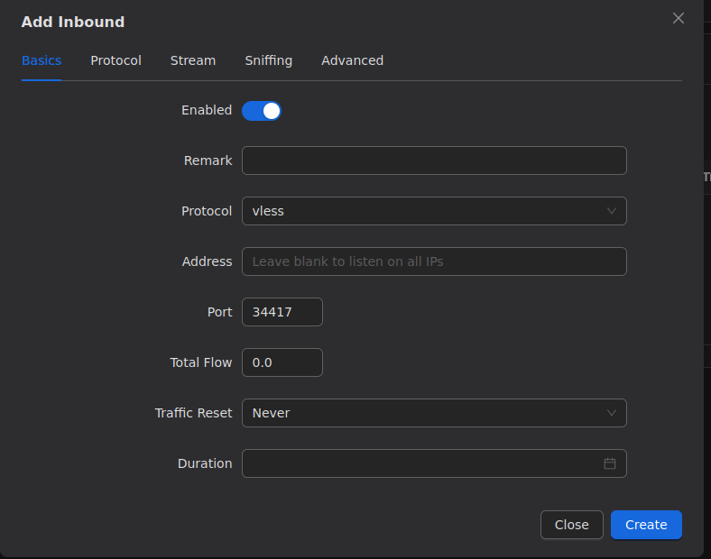
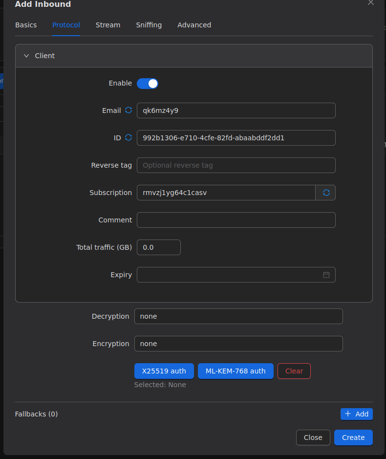
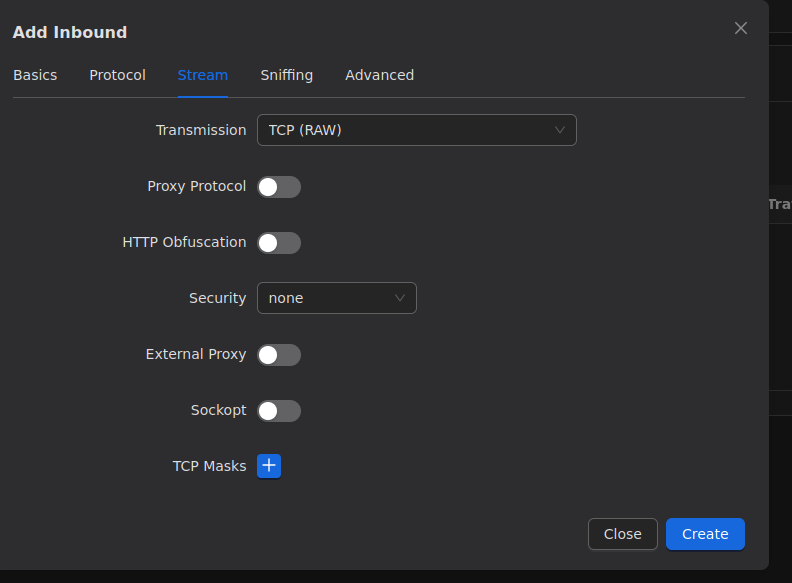
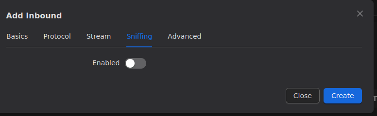
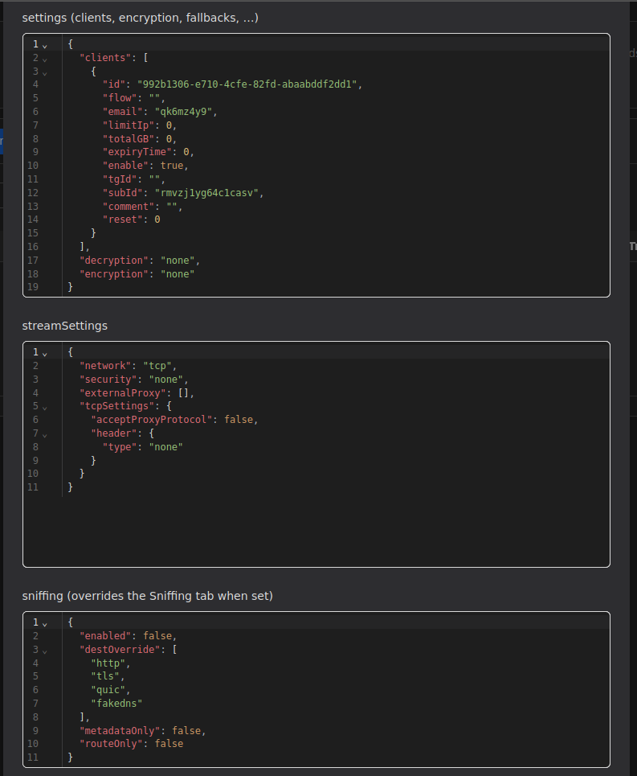

# راهنمای جامع اتصالات ورودی (Inbounds) و امنیت Reality

> **تمثیل کاربردی:** اتصال ورودی (Inbound) مانند **دروازه ورودی یک قلعه مستحکم** است. وقتی کاربران قصد ورود به اینترنت آزاد را دارند، ابتدا باید کلید و رمز عبور خود را به نگهبانان این دروازه نشان دهند. استفاده از تکنولوژی Reality باعث می‌شود این دروازه از بیرون به شکل یک ساختمان تجاری معمولی (سایت نقاب) به نظر برسد تا بازرسان شبکه متوجه ماهیت اصلی قلعه نشوند!

## بخش اول: تنظیمات پایه و افزودن کاربر (Basics & Protocol)

برای ساخت یک مسیر ارتباطی، ابتدا باید نوع قفل و پورت دروازه را مشخص کنیم.

### پارامترهای تب Basics:
- **Remark:** یک نام دلخواه برای این اتصال (مثلاً `VLESS-Reality-Main`).
- **Protocol:** نوع زبان ارتباطی. پروتکل **`vless`** سبک‌ترین، سریع‌ترین و ایده‌آل‌ترین گزینه برای ترکیب با قابلیت Reality است.
- **Port:** درگاهی که کلاینت‌ها به آن متصل می‌شوند. **برای سناریوی Reality اکیداً توصیه می‌شود فقط از پورت `443` استفاده کنید** تا ترافیک شما شبیه ترافیک عادی وب‌سایت‌های امن (HTTPS) به نظر برسد.
- **Total Flow:** در صورت نیاز می‌توانید محدودیت حجم ترافیک (گیگابایت) برای این ورودی تعیین کنید. `0.0` به معنای نامحدود است.

### پارامترهای تب Protocol (مدیریت کلاینت):
در این بخش، مشخصات منحصر‌به‌فرد کاربر تولید می‌شود:
- **Email:** یک نام یا ایمیل برای شناسایی کاربر در لیست اتصالات.
- **ID (UUID):** یک رشته رمزنگاری شده یکتا که مانند رمز عبور کاربر عمل می‌کند.
- **Subscription:** شناسه یکتا برای سیستم اشتراک‌دهی (سابسکرایپشن) تا کاربر بتواند لینک‌های خود را از راه دور دریافت و آپدیت کند.

---

## بخش دوم: تنظیمات انتقال و امنیت (Stream Settings)

این بخش مهم‌ترین قسمت برای تضمین پایداری و فرار از سیستم‌های مسدودسازی بازرسی عمیق بسته‌ها (DPI) است.

### پارامترهای تب Stream:
- **Transmission (نوع انتقال):** نحوه جابجایی بسته‌های داده را تعیین می‌کند. حالت **`TCP`** استانداردترین و پایدارترین گزینه برای استفاده در کنار پروتکل Reality است.
- **Security:** نوع نقاب امنیتی. با انتخاب گزینه **`Reality`**، این ویژگی فعال می‌شود. این قابلیت نیاز به خرید گواهینامه SSL را کاملاً برطرف کرده و ترافیک شما را پشت یک دامنه معتبر پنهان می‌کند.
- **Flow (جریان):** انتخاب الگوریتم انتقال. استفاده از **`xtls-rprx-vision`** فوق‌العاده حیاتی است. این الگوریتم الگوهای رفتاری بسته‌ها را مبهم می‌کند تا سیستم‌های فیلترینگ نتوانند ماهیت فیلترشکن بودن اتصال را شناسایی کنند.

---

## بخش سوم: شنود و هدایت هوشمند (Sniffing)

تکنولوژی شنود در شبکه (Sniffing) به هسته اجازه می‌دهد تا بداند بسته اطلاعاتی دقیقاً به کدام دامنه (Domain) ارسال شده است.

### پارامترهای تب Sniffing:
- **Enabled:** با فعال کردن این گزینه، هسته Xray ترافیک عبوری را بررسی می‌کند تا آدرس مقصد (مانند `google.com`) را استخراج کند. این کار برای اجرای قوانین مسیریابی (Routing Rules) بر اساس نام دامنه (مثلاً بلاک کردن دامنه‌های تبلیغاتی یا دور زدن سایت‌های ایرانی) ضروری است.

---

## بخش چهارم: پیکربندی خام (JSON Configuration)

برای مدیران حرفه‌ای سرور، پنل 3x-ui امکان مشاهده و ویرایش مستقیم ساختار کد JSON هر اتصال را فراهم کرده است.

### کاربرد تب Advanced (JSON):
- این بخش نمای خام و واقعی تنظیماتی است که در پشت پرده در هسته Xray ذخیره می‌شود.
- در این فایل، تمام بلوک‌ها اعم از `settings` (شامل UUID کلاینت‌ها)، `streamSettings` (شامل نوع انتقال شبکه و تنظیمات امنیتی TLS/Reality) و `sniffing` به وضوح مشخص است. اگر قصد دارید کدهای پیکربندی پیچیده‌تری که پنل از آن‌ها پشتیبانی گرافیکی نمی‌کند وارد کنید، می‌توانید مستقیماً این ساختار JSON را ویرایش کنید.
