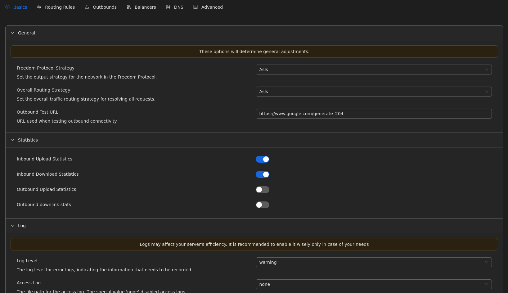
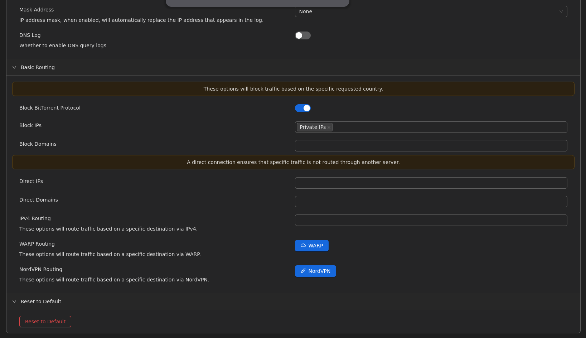
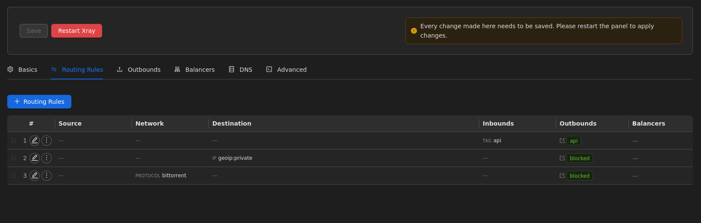
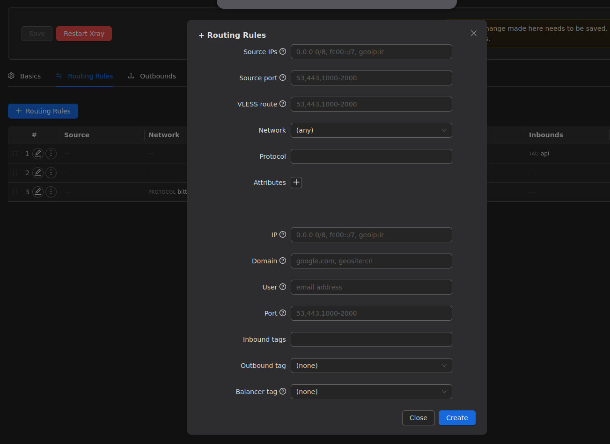
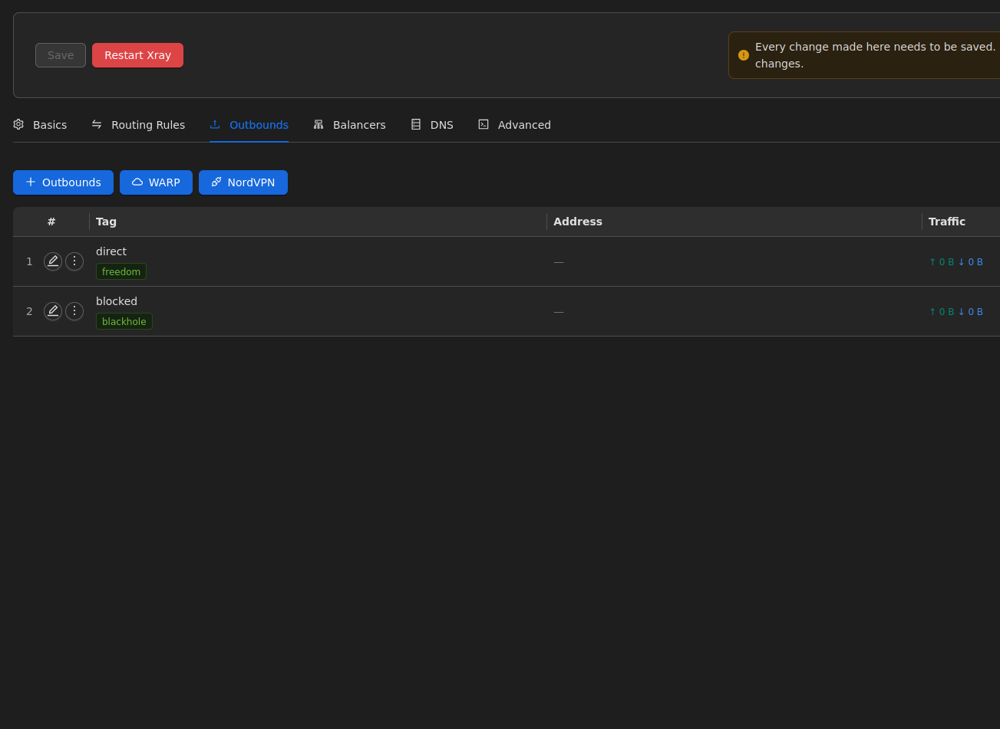
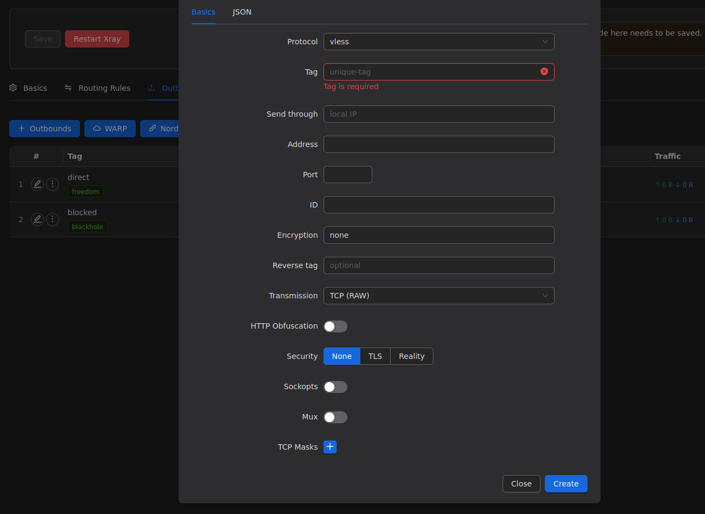
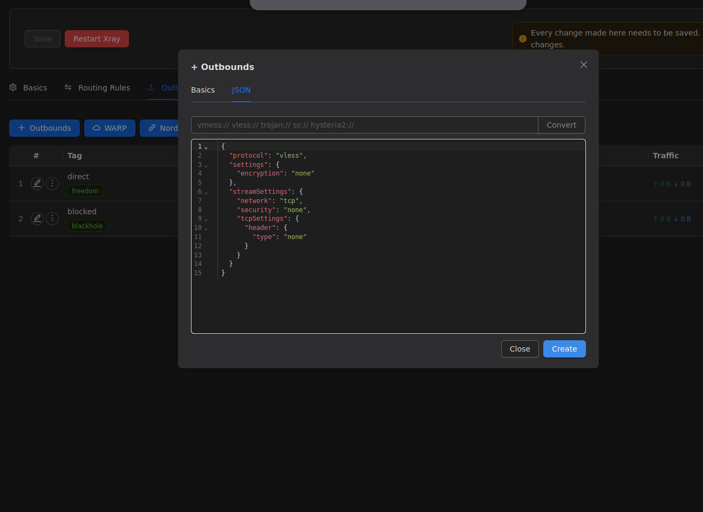
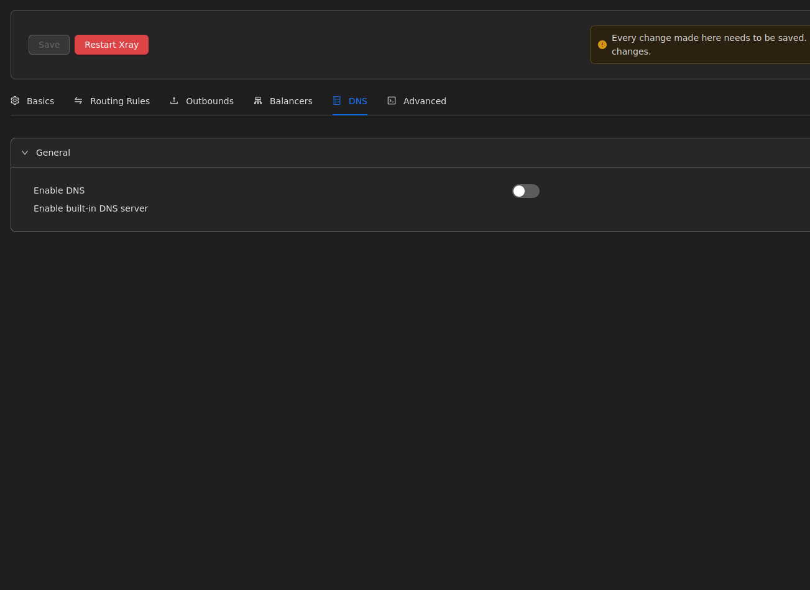
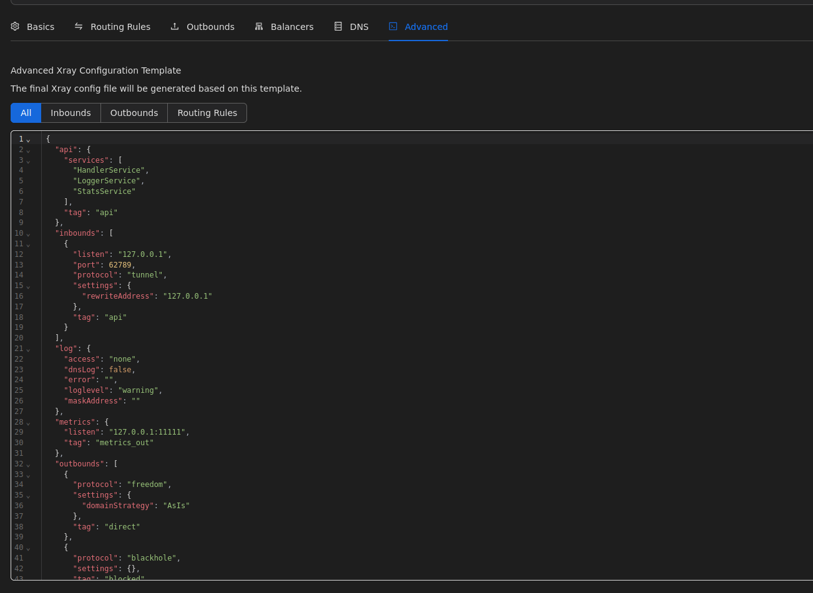
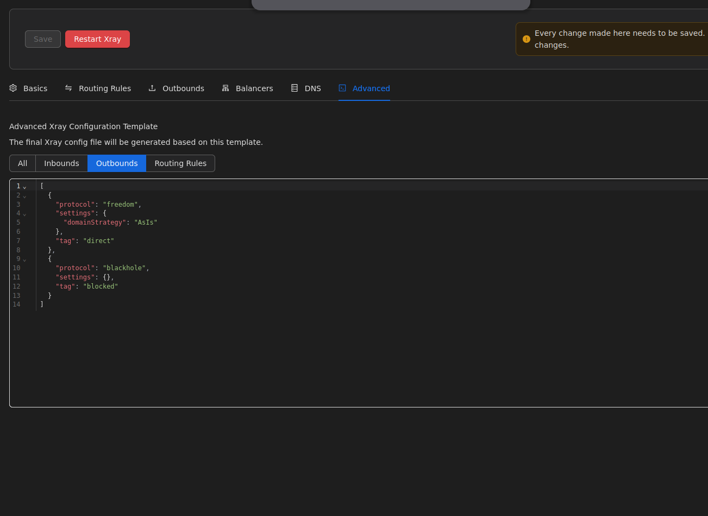

# راهنمای پیشرفته تنظیمات هسته، مسیریابی و اتصالات خروجی (Xray Routing)

> **تمثیل کاربردی:** سیستم مسیریابی (Routing) مانند یک **پلیس راهنمایی و رانندگی** است که در چهارراه خروجی سرور شما ایستاده است. وقتی یک بسته اینترنتی به سرور می‌رسد، این پلیس با نگاه کردن به مقصد آن تصمیم می‌گیرد: اگر بسته به مقصد یک سایت تحریمی است، آن را از جاده "دروازه شبکه دوم بدون فیلتر" عبور دهد؛ اگر یک بسته تبلیغاتی (ADs) یا بدافزار است، آن را مستقیماً به جاده بن‌بست (Blocked) هدایت کند تا مسدود شود!

## تنظیمات پایه هسته Xray (Basics)

در این بخش، آمارگیرها، سطح تولید لاگ، و پیش‌فرض‌های اولیه سیستم مدیریت می‌شوند.

### پارامترهای کلیدی:
- **Statistics:** فعال‌سازی آمارگیر (Statistics) برای نمایش زنده مصرف حجم دانلود و آپلود کاربران (Inbounds).
- **Log Level:** تعیین میزان ثبت وقایع سیستم. قرار دادن آن روی `warning` یا `error` از پر شدن بی‌دلیل فضای دیسک سرور (Storage) جلوگیری می‌کند.
- **Block BitTorrent:** فعال کردن این تیک **فوق‌العاده حیاتی** است! شرکت‌های ارائه‌دهنده سرور نسبت به دانلود فیلم‌های تورنت حساس هستند. این گزینه ترافیک تورنت را مستقیماً مسدود (Block) می‌کند تا سرور شما مسدود نشود.
- **Block Private IPs:** با این کار از اتصال کلاینت‌ها به آی‌پی‌های داخلی شبکه خصوصی سرور شما جلوگیری می‌شود که یک لایه امنیتی مهم است.

---

## قوانین مسیریابی (Routing Rules)

اینجا قلب تپنده تفکیک ترافیک در سیستم‌های مسیریابی هوشمند و سناریوی اتصال شبکه دوگانه (Dual-WAN) است.

### نحوه عملکرد قوانین:
قوانین مسیریابی از بالا به پایین اجرا می‌شوند. شما با ایجاد یک قانون جدید (Add Routing Rule) تعیین می‌کنید که چه ترافیکی باید به کجا (کدام Outbound) برود:
- **تفکیک با دامنه (Domain):** می‌توانید دامنه‌های ایرانی (مثل `geosite:ir` یا `.ir`) را به مسیر Direct (مستقیم) بفرستید تا کاربران فیلترشکن در باز کردن سایت‌های بانک‌های داخلی مشکلی نداشته باشند.
- **تفکیک با آی‌پی (IP):** بسته‌هایی که قصد اتصال به فضای شبکه خصوصی محلی دارند را مسدود (`geoip:private`) می‌کنیم.

---

## اتصالات خروجی (Outbounds)

خروجی‌ها (Outbounds) درگاه‌هایی هستند که سرور از طریق آن‌ها با دنیای اینترنت آزاد ارتباط برقرار می‌کند.

در پنل 3x-ui به صورت پیش‌فرض دو درگاه اصلی وجود دارد:
1. **درگاه `direct` (با پروتکل freedom):** خروجی مستقیم. در سناریوی شبکه دوگانه، ما در این بخش از طریق متغیر `sendThrough` آی‌پی کارت شبکه "اینترنت بین‌الملل آزاد" خود را مشخص می‌کنیم تا تمام ترافیک خروجی به صورت امن از آنجا عبور کند.
2. **درگاه `blocked` (با پروتکل blackhole):** سیاه‌چاله. هر ترافیکی (مثل تورنت یا تبلیغات) که توسط Routing Rules به این تگ ارسال شود، نابود می‌شود!

### افزودن خروجی‌های زنجیره‌ای (Warp / Chain Proxies)
شما می‌توانید خروجی‌های جدیدی (مانند اتصال به سرور Warp شرکت کلودفلر یا اتصال VLESS به یک سرور ثالث) ایجاد کنید تا آی‌پی خروجی سرور خود را برای دور زدن تحریم‌های خارجی (سایت‌هایی که به آی‌پی دیتاسنترها حساس هستند) تغییر دهید.

در تب ساخت خروجی، امکان وارد کردن کدهای JSON خام (Raw Config) ساب‌اسکریپشنِ یک سرور واسط (مثلا VMess یا Hysteria2) به صورت مستقیم فراهم شده است که با فشردن دکمه `Convert` به صورت خودکار به تنظیمات Xray تبدیل می‌شود.

---

## دی‌ان‌اس (DNS) و نمای پیشرفته JSON

یکی از تکنیک‌های مهم در افزایش سرعت باز شدن سایت‌ها برای کاربران، استفاده از DNS اختصاصی درون خود هسته Xray است.

با فعال‌سازی بخش **DNS**، می‌توانید سرور را مجبور کنید درخواست‌های نام دامنه را از طریق سرورهای معتبر خارجی (مانند `1.1.1.1` یا DNSهای رمزنگاری شده `DoH`) عبور دهد تا از شنود ترافیک محلی جلوگیری شود.

### نمای پیشرفته (Advanced JSON View)
اگر یک مدیر شبکه حرفه‌ای (Sysadmin) هستید، پنل به شما این امکان را می‌دهد که کل ساختار JSON در حال اجرا در Xray را به صورت یکپارچه بررسی کنید. 

در این بخش، ساختار سرویس‌های داخلی API پنل، بلوک `inbounds` که برای اتصال پنل به هسته تعبیه شده، و بلوک‌های `outbounds` و `routing` به صورت خام در دسترس قرار دارند.
