

# راهنمای تنظیمات سیستم، امنیت پنل و مستندات API

> **تمثیل کاربردی:** تنظیمات اصلی پنل مانند **مدیریت داخلی ساختمان مدیریت** است. در این ساختمان شما تعیین می‌کنید چه کسی کلید ورود دارد (Authentication و 2FA)، آدرس پستی مخفی ساختمان کجاست (Base Path)، چه امکانات خودکاری برای کارمندان فراهم شده است (Telegram Bot و LDAP) و سیستم اشتراک‌های دوره‌ای (Subscription) چگونه به مشتریان تحویل داده شود.

## تنظیمات عمومی پنل (General Settings)

بخش عمومی تنظیمات برای پیکربندی درگاه‌های اصلی دسترسی به خود وب‌پنل استفاده می‌شود.

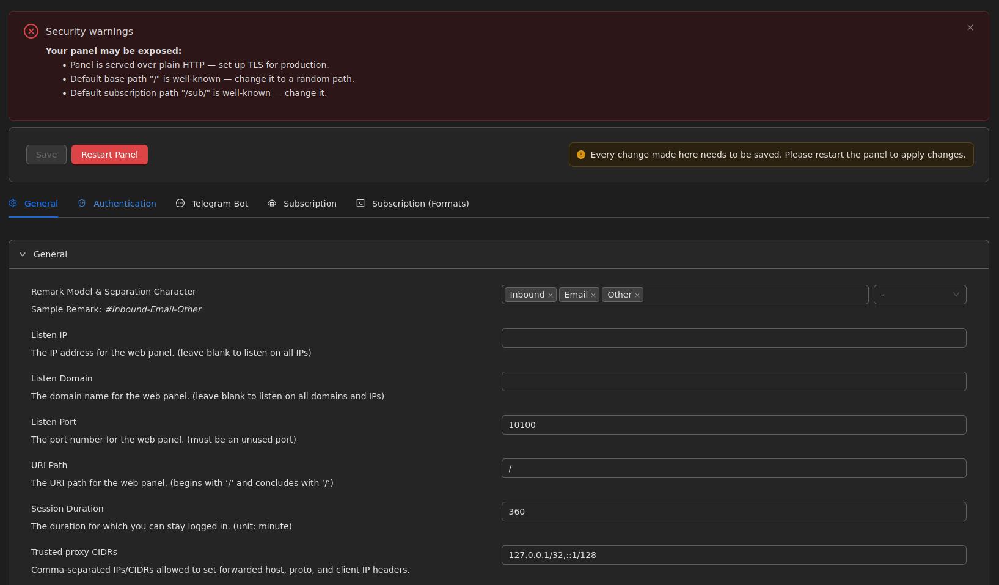
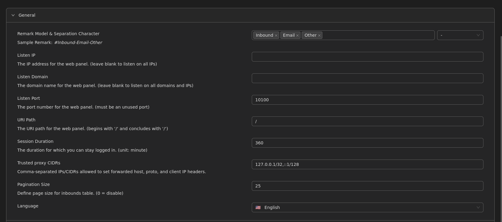

### پارامترهای حیاتی امنیتی:
- **Listen Port:** پورتی که پنل گرافیکی روی آن اجرا می‌شود (به صورت پیش‌فرض ۲۰۵۳). هرگز از پورت‌های معروف (۸۰ یا ۴۴۳) برای دسترسی به محیط مدیریتی پنل استفاده نکنید تا در معرض حملات اسکنرهای شبکه قرار نگیرید.
- **URI Path (Base Path):** **بسیار مهم!** به صورت پیش‌فرض پنل در مسیر اصلی (`/`) باز می‌شود. برای جلوگیری از هک شدن و یافتن پنل توسط ربات‌ها، حتماً یک رشته تصادفی و مخفی (مانند `/my-secret-panel-892/`) در این فیلد قرار دهید.
- **Session Duration:** مدت زمانی (به دقیقه) که در صورت عدم فعالیت در پنل، شما از سیستم خارج (Logout) می‌شوید.
- **تغییر تم و زبان:** امکان تغییر زبان سیستم به English یا فارسی و تغییر تم تاریک/روشن.

### اعلان‌ها و گواهینامه‌ها (Notifications & Certs)
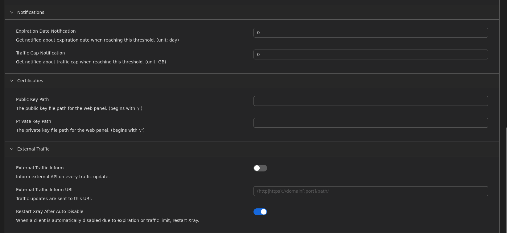
در این بخش می‌توانید مسیر فایل‌های گواهینامه امنیتی (SSL Public/Private Keys) را برای لود شدن پنل با پروتکل امن HTTPS مشخص کنید و اعلان‌های رسیدن کاربر به سقف مصرف ترافیک (Traffic Cap Notification) را فعال سازید.

---

## احراز هویت و ورود دو مرحله‌ای (Authentication & Security)

امنیت رمزهای عبور، اساسی‌ترین خط دفاعی سرور شماست.

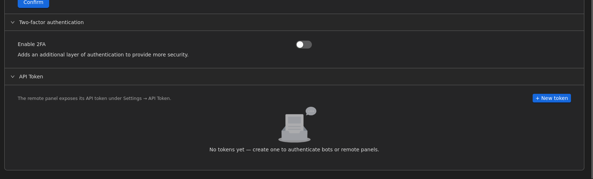

- **Two-factor authentication (2FA):** فعال‌سازی **ورود دو مرحله‌ای** از طریق اپلیکیشن‌هایی مانند Google Authenticator. با این کار حتی اگر رمز عبور مدیریت شما فاش شود، هکر نمی‌تواند بدون دسترسی به کدهای یک‌بار‌مصرف گوشی موبایل شما وارد پنل شود.
- **API Tokens:** اگر قصد دارید اپلیکیشن‌های جانبی یا ربات‌های تلگرامی را به پنل متصل کنید، به جای دادن نام کاربری و رمز عبور اصلی، یک توکن (Token) مخصوص و موقت بسازید و در اختیار آن‌ها قرار دهید.

---

## سیستم یکپارچه‌سازی کاربران (LDAP Configuration)

برای سازمان‌ها و شرکت‌هایی که صدها کارمند دارند، تعریف دستی نام کاربری برای همه دشوار است.

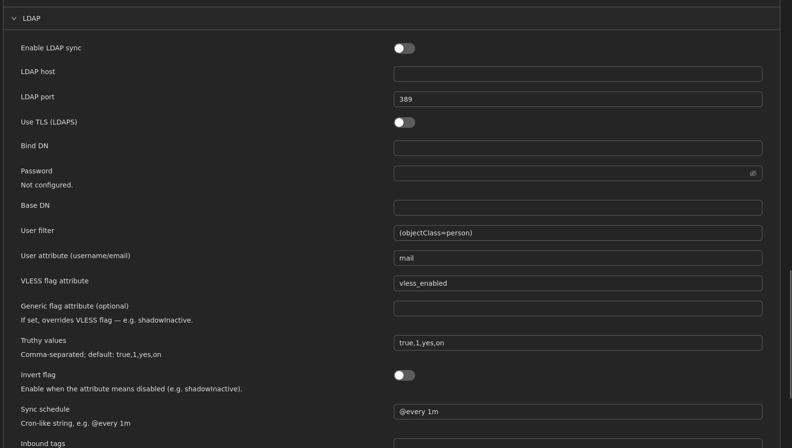
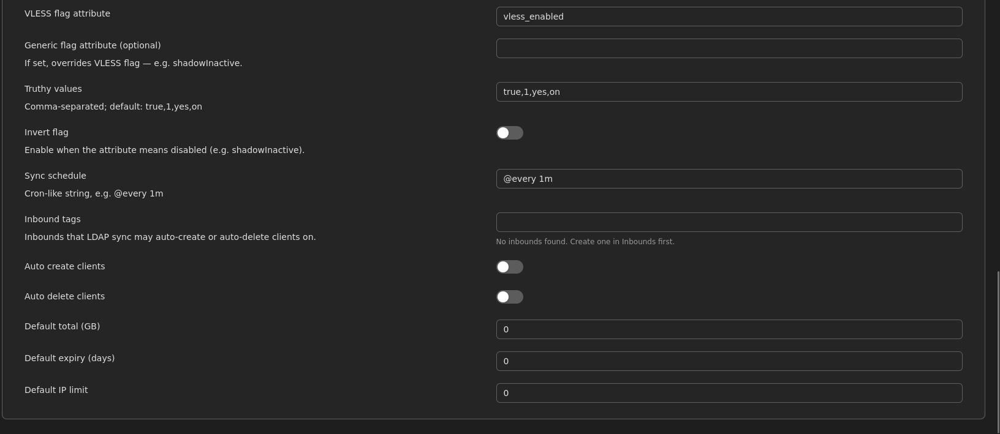

با اتصال پنل به سرورهای **LDAP (مانند Microsoft Active Directory)**، کاربران شرکت می‌توانند با همان نام کاربری و رمز عبور سازمانی خود مستقیماً در شبکه فیلترشکن شرکت نیز احراز هویت شوند. ویژگی Auto Delete Clients این امکان را می‌دهد تا به محض اخراج کارمند از سیستم شرکت، دسترسی او به صورت خودکار به شبکه نیز قطع شود.

---

## سیستم توزیع اشتراک (Subscription Server)

سیستم سابسکرایپشن به کاربران اجازه می‌دهد لینک اختصاصی خود را در اپلیکیشن (مانند v2rayNG) وارد کنند تا در آینده نیازی به دریافت دستی لینک‌های جدید از شما نداشته باشند.

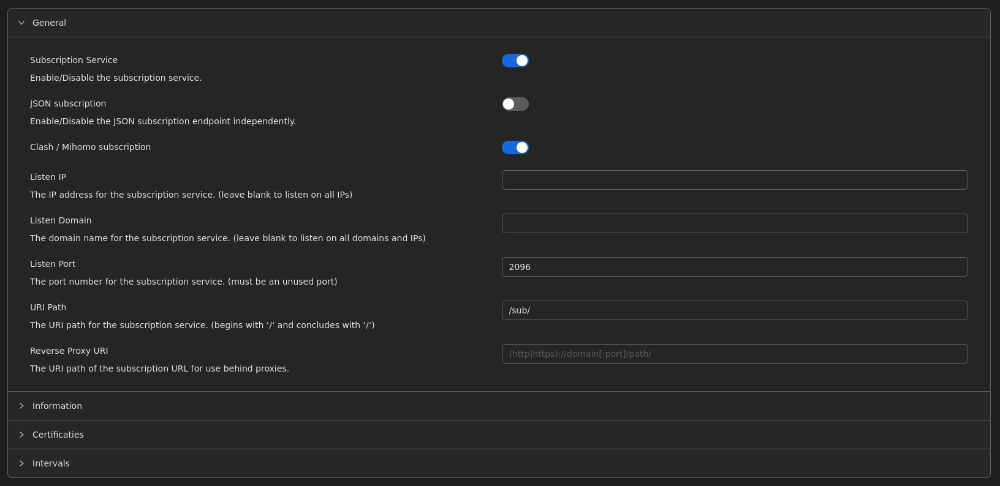
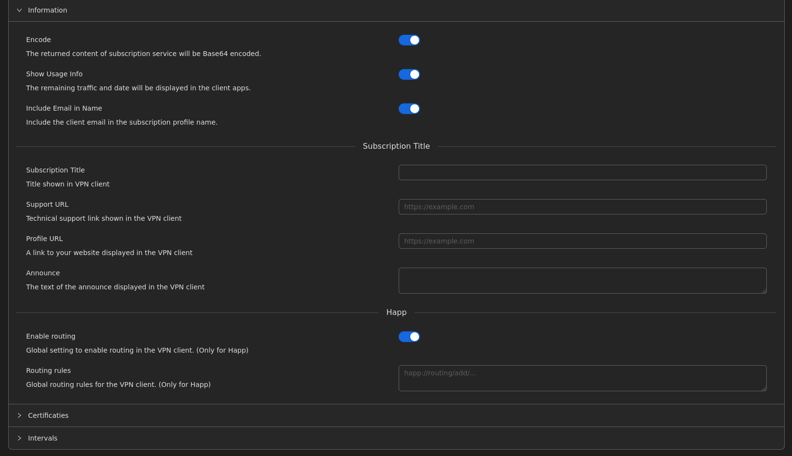

### پارامترهای طلایی سابسکرایپشن:
- **Listen Port:** پورت اختصاصی برای سرویس‌دهی لینک‌های آپدیت.
- **Show Usage Info:** با فعال کردن این گزینه، میزان ترافیک مصرف‌شده (GB) و تاریخ انقضا به صورت یک بنر (پروفایل فیک) در بالای برنامه‌های کاربری نمایش داده می‌شود تا کاربر همیشه از وضعیت حجم خود مطلع باشد.
- **Clash / Mihomo Format:** پشتیبانی از خروجی‌های اختصاصی برای کلاینت‌های نرم‌افزار Clash.
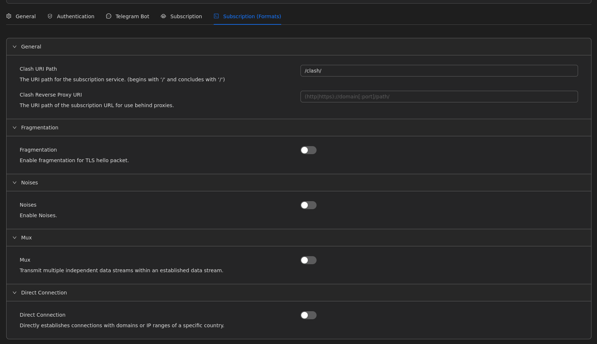

---

## مستندات توسعه‌دهندگان (API Documentation)

برای توسعه‌دهندگانی که قصد دارند سامانه‌های فروش، ربات‌های هوشمند و مانیتورینگ اختصاصی طراحی کنند، پنل 3x-ui یک درگاه استاندارد REST API ارائه می‌دهد.

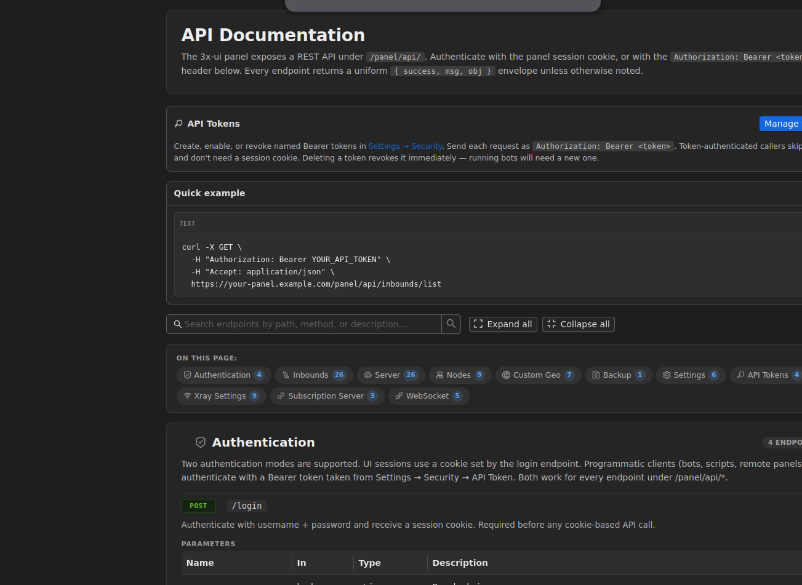
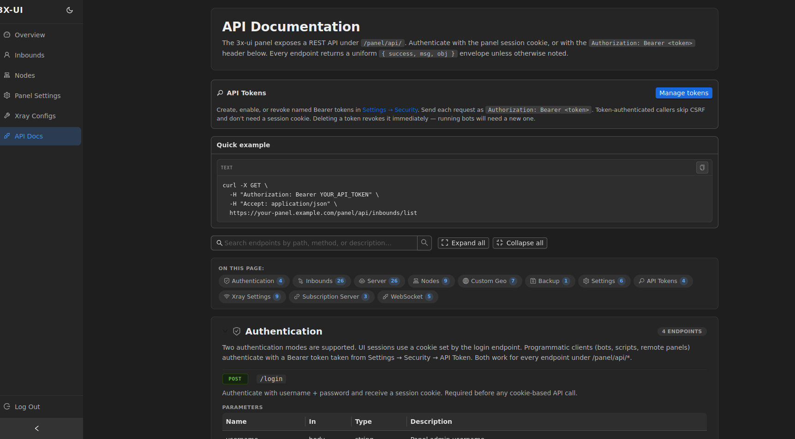

مستندات این بخش (API Docs) که در منوی کناری تعبیه شده، راهنمای بی‌نظیری برای برقراری ارتباط سیستمی با پنل از طریق دستورات `GET`, `POST`, `PUT` به صورت رمزنگاری شده با کوکی یا توکن‌های دسترسی (Bearer Tokens) فراهم کرده است.
