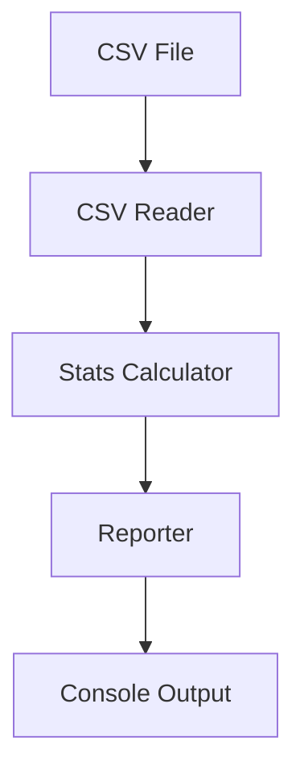

<style>
body, p, h1, h2, h3, h4, h5, h6, li, ul, ol {
  font-family: 'Segoe UI', Segoe, Tahoma, Geneva, Verdana, sans-serif !important;
  direction: rtl;
  text-align: right;
}
pre, code {
  direction: ltr;
  text-align: left;
}
.markdown-body table,
.markdown-preview-section table,
table {
  direction: rtl !important;
  text-align: right !important;
  width: 100%;
  border-collapse: collapse;
  margin-inline-start: 0;
  margin-inline-end: auto;
}
.markdown-body th,
.markdown-body td,
.markdown-preview-section th,
.markdown-preview-section td,
table thead th,
table tbody td,
table th,
table td {
  text-align: right !important;
  direction: rtl;
  vertical-align: top;
  padding: 0.35em 0.5em;
}
table td code,
table th code,
.markdown-body table td code,
.markdown-body table th code {
  direction: ltr;
  unicode-bidi: embed;
  text-align: right !important;
  display: inline-block;
}
.task-list-item input[type="checkbox"],
input.task-list-item-checkbox {
  margin: 0 0.5em 0 0 !important;
}
</style>


چگونه از هوش مصنوعی در برنامه نویسی حرفه ای تر استفاده کنیم.
---

## خلاصه‌ی مشکل شما
- مدل‌های رایگان هوش مصنوعی (مثل نسخه‌های رایگان ChatGPT، Claude، Gemini و…) گاهی در یک چرخه‌ی بی‌پایان اشکال‌زدایی گیر می‌کنند.
- کد اضافه و زیادی تولید می‌شود.
- برنامه به جای اینکه تمیز و ماژولار باشد، تبدیل به یک تکه کد بزرگ و درهم می‌شود.
- شما دنبال روشی قدم‌به‌قدم هستید تا پاسخ‌های مدل‌های رایگان را **کیفی‌تر، مستندتر و تست‌شده‌تر** کنید.

---

## اصل ماجرا: تفاوت بین استفاده‌ی حرفه‌ای و غیرحرفه‌ای از AI
بسیاری از برنامه‌نویسان فکر می‌کنند مشکل از «رایگان بودن مدل» است، اما در واقع مشکل اصلی **روش کار** است. حتی مدل‌های پولی هم اگر unstructured استفاده شوند، همان کدهای اضافی و چرخه‌های طولانی را تولید می‌کنند.

---

## راه‌حل کلیدی: تغییر از «کد-محور» به «مستند-محور» (Spec-Driven)

یعنی قبل از اینکه از AI بخواهید یک خط کد بنویسد، اول با او روی **مقیاس کار** (چه کاری باید انجام شود) و **طراحی** (چطور انجام شود) به توافق برسید.

### ابزارهایی مثل OpenSpec
این ابزارها به شما کمک می‌کنند که قبل از کدنویسی، یک سند مشخص بنویسید:
- **پیشنهاد (Propose)** : چه قابلیتی می‌خواهید؟
- **طراحی (Design)** : چه کلاس‌ها و توابعی نیاز است؟
- **کارها (Tasks)** : لیست قدم‌های کوچک و قابل اجرا
- **تأیید (Verify)** : چطور تست می‌کنید که درست کار می‌کند؟

> حتی بدون OpenSpec، می‌توانید همین مراحل را در یک فایل متنی یا در همان چت با AI پیاده کنید.

---

## قدم ۱: ساختاردهی به درخواست‌های خود به AI

### به جای:
> «یه برنامه بنویس که فایل CSV رو بخونه و گزارش بده»

### بنویسید:
> **مرحله ۱ - مشخصات:**
> - ورودی: مسیر فایل CSV با ستون‌های name, age, salary
> - خروجی: چاپ میانگین سن و حقوق، به همراه تعداد رکوردها
> - خطاها: اگر فایل نبود یا ستون اشتباه بود، پیام خطای مناسب بده
>
> **مرحله ۲ - طراحی:**
> - یک تابع برای خواندن و اعتبارسنجی CSV
> - یک تابع برای محاسبه آمار
> - یک تابع main برای چاپ نتایج
>
> **مرحله ۳ - لطفاً ابتدا فقط طرح (pseudo-code) را بنویس، سپس کد پایتون تمیز همراه با docstring.**

این کار باعث می‌شود AI کمتر دچار اشتباه شود و کد اضافه ننویسد.

---

## قدم ۲: ایجاد چرخه‌ی «تست-بازخورد-رفع اشکال» بدون حلقه بی‌نهایت

### روش سه مرحله‌ای:
1. **از AI بخواهید اول تست بنویسد** (مثلاً با pytest یا unittest).  
   - این تست‌ها شکست می‌خورند چون کد هنوز نوشته نشده.
2. **بعد از AI بخواهید کد را به گونه‌ای بنویسد که آن تست‌ها را پاس کند.**
3. **اگر تست خراب شد**، خطای کامل را کپی کنید و از AI بخواهید فقط همان خطا را رفع کند (نه کل کد را از نو بنویسد).

> این روش از «چرخه‌ی دیباگ طولانی» جلوگیری می‌کند، چون AI مجبور نیست کل برنامه را دوباره تحلیل کند.

---

## قدم ۳: تقسیم برنامه به کلاس‌ها و فایل‌های کوچک (Modularity)

به AI دستورهای مشخص بدهید:

> «کد را در فایل‌های زیر جدا کن:
> - `csv_reader.py` (مسئول خواندن و اعتبارسنجی)
> - `stats_calculator.py` (مسئول محاسبات)
> - `reporter.py` (مسئول چاپ و گزارش)
> - `main.py` (اجرای اصلی)
> هر فایل حداکثر ۵۰ خط داشته باشد. برای هر فایل یک docstring بنویس که وظیفه‌اش را توضیح دهد.»

---

## قدم ۴: مستندسازی همزمان با کد

- از AI بخواهید در حین نوشتن کد، **توضیحات خط به خط** به صورت کامنت یا docstring اضافه کند.
- بعد از اتمام هر بخش، دستور بدهید:  
  «حالا یک فایل README.md بنویس که شامل: هدف برنامه، نحوه اجرا، ساختار فایل‌ها، و نمونه خروجی باشد.»
- برای دیاگرام: از AI بخواهید دیاگرام را با **Mermaid** بنویسد (چون در محیط‌های رایگان مثل GitHub یا Obsidian قابل نمایش است). مثال:



سپس آن را در یک فایل `diagram.md` ذخیره کنید.

---

## قدم ۵: بهترین قوانین (Rules) و مهارت‌ها (Skills) برای کار با مدل‌های رایگان

### قانون ۱: همیشه با یک «فایل قوانین» شروع کن
یک فایل به اسم `RULES_FOR_AI.txt` یا `CLAUDE.md` در ریشه‌ی پروژه بساز و داخلش بنویس:

```text
1. قبل از نوشتن کد، حتماً یک خلاصه از طراحی ارائه بده.
2. هیچ گاه بیش از ۷۰ خط کد در یک فایل ننویس.
3. برای هر تابع، حتماً type hint و docstring بنویس.
4. همیشه ابتدا تست‌های واحد را پیشنهاد بده.
5. از توابع تکراری و کد اضافی (duplicate code) اجتناب کن.
6. اگر چیزی واضح نیست، سؤال بپرس، فرض نکن.
```

سپس در هر پرامپت به AI یادآوری کن: «بر اساس قوانین فایل RULES_FOR_AI عمل کن.»

### قانون ۲: از «تکنیک دو مدل» استفاده کن
- مدل A را برای نوشتن کد استفاده کن.
- خروجی آن را به مدل B (حتی همان مدل با یک پرامپت جدید) بده و بگو: «این کد را از نظر باگ، امنیت، کارایی، و رعایت اصول تمیز کدنویسی بررسی کن.»

### قانون ۳: محدودیت‌های کانتکست را مدیریت کن
مدل‌های رایگان معمولاً حافظه کوتاه‌مدت محدودی دارند. برای حل:
- هر بار فقط روی یک فایل یا یک کلاس تمرکز کن.
- بعد از هر ۳-۴ پیام، خلاصه‌ای از تصمیمات گرفته‌شده را از AI بخواه و ذخیره کن (برای ادامه بعدی).

---

## قدم ۶: جمع‌بندی یک گردش کار عملی (Workflow)

| مرحله | کاری که انجام می‌دهی | نمونه دستور به AI |
|--------|----------------|-------------------|
| ۱ | نوشتن قوانین پروژه | «فایل RULES_FOR_AI.txt را با این ۶ قانون بساز.» |
| ۲ | مشخصات و طراحی | «ابتدا یک سند یک صفحه‌ای با OpenSpec-like بنویس: هدف، موجودیت‌ها، توابع اصلی.» |
| ۳ | تولید تست‌ها | «برای هر تابع طراحی‌شده، یک تست بنویس با pytest.» |
| ۴ | تولید کد (ماژولار) | «اکنون کد را در فایل‌های جداگانه مطابق با قوانین بنویس.» |
| ۵ | بازبینی با مدل دوم | «کد تولیدشده را بررسی کن و فقط اشکالات را فهرست کن (بدون بازنویسی کامل).» |
| ۶ | رفع خطاها | «خطای شماره ۱ را با حداقل تغییرات رفع کن.» |
| ۷ | مستندسازی | «یک README و یک دیاگرام Mermaid از جریان داده بنویس.» |
| ۸ | ذخیره وضعیت | «یک فایل PROGRESS.txt بساز که در آن کارهای انجام‌شده و کارهای باقی‌مانده را لیست کن.» |

---

## انتخاب مدل‌های رایگان خوب برای کدنویسی
اگرچه همه مدل‌های رایگان محدودیت دارند، اما برای کدنویسی این‌ها معمولاً بهتر عمل می‌کنند:
- **DeepSeek Coder V2** (رایگان، قدرتمند برای پایتون/جاوا)
- **Qwen2.5-Coder-32B** (از طریق HuggingChat یا Together.ai)
- **CodeGemma** (برای کارهای محلی با منابع کم)
- **Claude 3 Haiku** (از طریق Poe یا برخی سرویس‌های رایگان با محدودیت روزانه)

---

## حرف آخر
با رعایت همین قدم‌ها (مخصوصاً **نوشتن مشخصات قبل از کد** و **تست اول**)، حتی مدل‌های رایگان هم می‌توانند خروجی بسیار تمیز، مستند و قابل نگهداری تولید کنند.  
کلید موفقیت این است که شما کنترل ساختار را در دست بگیرید، نه اینکه AI را رها کنید هر طور دوست دارد کد بزند.

اگر سوال بیشتری در مورد هر یک از این مراحل دارید، بپرسید تا با مثال عملی توضیح دهم.